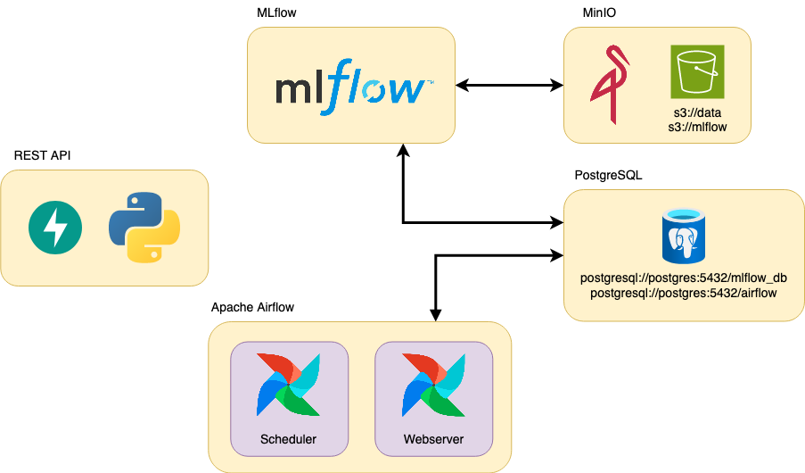
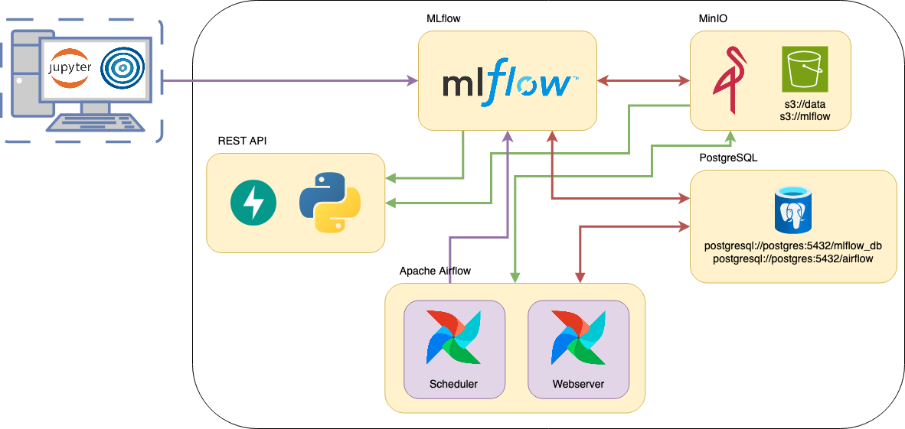
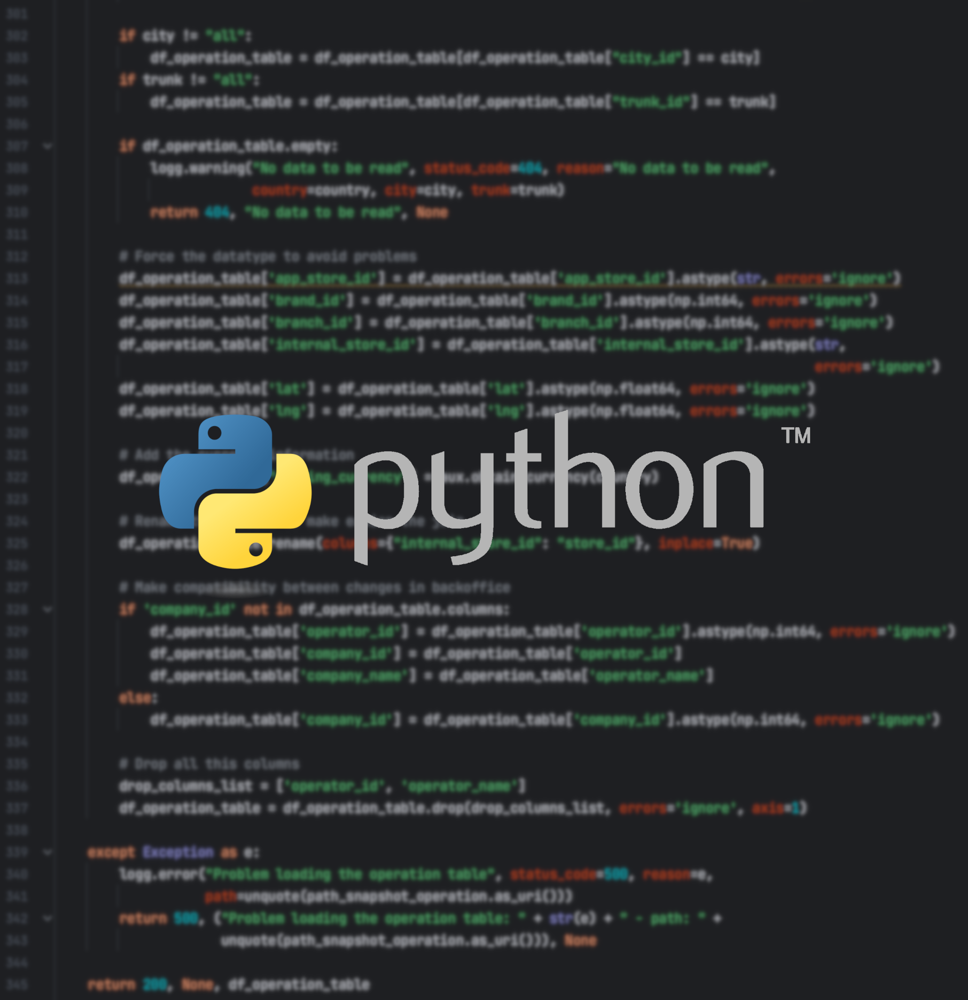
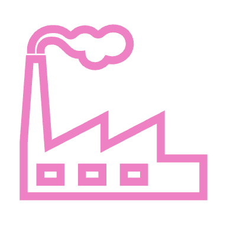
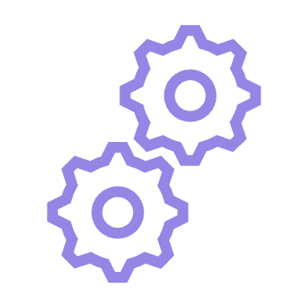
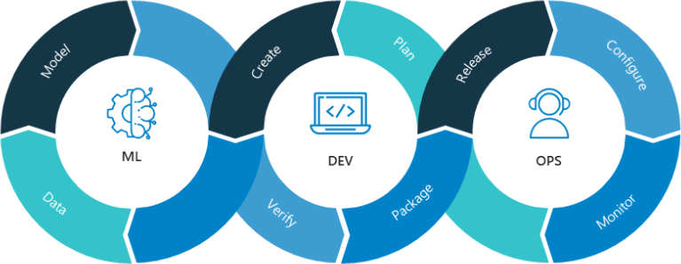

## Diapositiva 1: Introducción

* Operaciones de Aprendizaje Automático I - CEIA - FIUBA

Dr. Ing. Facundo Adrián Lucianna

---

## Diapositiva 2: Introducción

* Materia de 8 clases teórico-prácticas

* Clases con diapositivas y desarrollo

* Algunas clases desarrollaremos algún hands-on para familiarizarnos con las herramientas.

* Estructuras de las clases:

  * 10 minutos repaso de clase anterior

  * 3 bloques de 50 minutos de clases teórico-practicas

  * 2 recreos de 10 minutos

  * Ejercicio de practica entre las clases. Sin entrega y evaluación.

---

## Diapositiva 3: Introducción

* Aula virtual

* https://campusposgrado.fi.uba.ar/course/view.php?id=245

* Repositorio de la materia:

* https://github.com/FIUBA-Posgrado-Inteligencia-Artificial/aprendizaje_maquina_II

* Consultas

  * Foro de consulta en el aula virtual

  * Correo (consultas generales envíen con copia a los dos)

    * Facundo Adrián Lucianna: facundolucianna@gmail.com

---

## Diapositiva 4: Evaluación

* La evaluación de los conocimientos impartidos durante las clases será a modo de entrega de un trabajo práctico final en dos partes. El trabajo es obligatoriamente grupal (máximo 6 personas).

* La fecha de entrega de la primera parte es en la clase 5 y la entrega final es 7 días después de la última clase.

* La idea de este trabajo es suponer que trabajamos para **ML****Models****and****something****more Inc.,**la cual ofrece un servicio que proporciona modelos mediante una REST API o predicción por lote.

* Internamente, tanto para realizar tareas de DataOps como de MLOps, la empresa cuenta con Apache Airflow y MLflow. También dispone de un Data Lake en S3.

* Tenemos dos diferentes tipos de tareas (modo local o modo en contenedores) que lo vemos más adelante.

---

## Diapositiva 5: Evaluación

* El sistema está desarrollado en Docker y la base se encuentra en: https://github.com/facundolucianna/amq2-service-ml

---

## Diapositiva 6: Evaluación

* Para ayudarlos, pueden encontrar un ejemplo en: https://github.com/facundolucianna/amq2-service-ml/tree/example_implementation

---

## Diapositiva 7: Evaluación

* Ofrecemos tres tipos de evaluaciones:

* **Nivel local**(nota entre 6 y 8): Implementar en local un ciclo de desarrollo del modelo que desarrollaron en Aprendizaje de Máquina hasta la generación final del artefacto del modelo entrenado. Deben usar un orquestador y buenas prácticas de desarrollo con buena documentación.

* **Nivel en contenedores**(nota entre 8 y 10): Implementar el modelo que desarrollaron en Aprendizaje de Máquina en el ambiente productivo. Para ello, pueden usar los recursos que consideren apropiado. Los servicios disponibles de base son Apache Airflow, MLflow, PostgresSQL, MinIO, FastAPI. Todo está montado en Docker, por lo que además deben instalado Docker.

---

## Diapositiva 8: Herramientas

* Lenguaje de Programación

  * Python >=3.10

  * Poetry / Pip / Conda para instalar librerías

* Librerías

  * MLflow

  * Librerías de manejo de datos y de modelos de aprendizaje automático.

  * Jupiter Notebook

* Herramientas

  * GitHub para repositorios

  * Docker

  * Apache Airflow

* IDE Recomendados

  * Visual Studio Code

  * PyCharmCommunityEdition

---

## Diapositiva 9: Programa

1

Ciclo de vida de un proyecto de Aprendizaje Automático. Machine LearningOperations (MLOps). Niveles de MLOps. Entorno productivo. Buenas prácticas de programación.

2

Desarrollo de modelos. Selección del tipo de modelo. Las 4 fases del desarrollo de modelos. Ensambles. Depurando modelos. Entrenamiento distribuido. Métodos de evaluación. Desplegado de modelos. Contenedores y Docker.

3

Infraestructura. Capa de almacenamiento. Capa de cómputo. Plataforma de ML. MLFlow.

4

Administración de recursos. Orquestadores y sincronizadores. Gestión del flujo de trabajo de ciencia de datos. Apache Airflow

---

## Diapositiva 10: Programa

5

Despliegue de modelos. Estrategias de despliegue. Sirviendo modelos. Propiedades del entorno de ejecución de un modelo. Predicción en lotes

6

Despliegue de modelos. Desplegado on-line. APIs y Microservicios. REST API. Implementación de REST APIs en Python

7

Sirviendo modelos en el mundo real. Estrategias de implementación. Ejemplo de servicios de modelos

---

## Diapositiva 11: Bibliografía

* Designing Machine LearningSystems. An Iterative ProcessforProduction-ReadyApplications - Chip Huyen (Ed. O’Reilly)

* Machine LearningEngineeringwith Python: Managetheproductionlifecycleof machine learningmodelsusingMLOpswithpracticalexamplesv - Andrew P. McMahon (Ed. Packt Publishing)

* EngineeringMLOps: Rapidlybuild, test, and manageproduction-ready machine learninglifecycles at scale - Emmanuel Raj (Ed. Packt Publishing)

* IntroducingMLOps: HowtoScale Machine Learning in the Enterprise -  Mark Treveil, Nicolas Omont, Clément Stenac, Kenji Lefevre, Du Phan, Joachim Zentici, Adrien Lavoillotte, Makoto Miyazaki, Lynn Heidmann (Ed. O’Reilly)

* PracticalMLOps: Operationalizing Machine LearningModels -  Noah Gift, Alfredo Deza (Ed. O’Reilly)

* Machine LearningEngineering - AndriyBurkov (Ed. True Positive Inc.)

* Machine LearningEngineering in Action - Ben Wilson (Manning)

---

## Diapositiva 12: Ciclo de vida de un proyecto de Aprendizaje Automático

Operaciones de Aprendizaje Automático I - CESE - FIUBA

---

## Diapositiva 13: Ciclo de vida de un proyecto de Aprendizaje Automático

Problema de negocio

Definición de objetivos

Recolección de datos y preparación

Featureengineering

Evaluación del modelo

Despliegue del modelo

Servicio del modelo

Monitoreo del modelo

Mantenimiento del modelo

Entrenamiento del modelo

---

## Diapositiva 14: Ciclo de vida de un proyecto de Aprendizaje Automático

* A lo largo del ciclo de vida de un proyecto de ML deben intervenir varios participantes para que el desarrollo se lleve a cabo de la mejor manera posible. La distribución de tareas en los distintos roles puede varias según cada una de las organizaciones, pero de manera general podemos definir las siguientes:

* Data Engineer

* Data Scientist

* Data Analyst

* Machine LearningEngineer

---

## Diapositiva 15: Ciclo de vida de un proyecto de Aprendizaje Automático

Data Engineer

Data Scientist

Data Analyst

Machine LearningEngineer

El Data Engineer es responsable de la **preparación y limpieza de los datos**, la creación de **pipelines de datos**y la integración de diferentes fuentes de datos.

Su trabajo también incluye la selección de las herramientas y tecnologías adecuadas para la gestión de datos y la implementación de soluciones de **almacenamiento y procesamiento de datos escalables**.

El Data Scientist se encarga de **definir y crear modelos de machine****learning**que permitan hacer predicciones a partir de los datos. Su trabajo implica seleccionar los algoritmos adecuados, entrenar los modelos y optimizar su rendimiento.

Los Data Scientists también pueden participar en la identificación de variables relevantes y en la **exploración de los datos para encontrar patrones y tendencias.**

El Data Analyst trabaja con datos para descubrir patrones y tendencias que puedan ser útiles para la **toma de decisiones empresariales**. Su trabajo implica realizar análisis estadísticos y visualizaciones de datos para **entenderlos mejor**y hacer recomendaciones sobre cómo pueden utilizarse **para mejorar el negocio.**

El Machine LearningEngineer es responsable de llevar los modelos de machine learning a **producción****y asegurarse de que estén funcionando correctamente.**

Su trabajo implica seleccionar la infraestructura adecuada para el despliegue de los modelos, integrar los modelos con otras aplicaciones y sistemas, y **supervisar el rendimiento de los modelos.**

---

## Diapositiva 16: Consideraciones para aplicaciones en industria

**Producción**

Para que el modelo pueda entregar valor al negocio debe estar productivo.

**Usabilidad**

Un modelo con 70% de exactitud en producción produce mucho más valor que uno con 100% de exactitud que no se puede usar.

**Dependencia**

Los modelos en producción requieren mantenimiento para prevenir el desvío en los datos o en el target.

**Escalabilidad**

El proceso debe ser implementado para que otras personas del equipo lo entiendan, debe ser transparente y replicable.

---

## Diapositiva 17: Consideraciones para aplicaciones en industria

* Veamos un sistema ejemplo de una implementación de un servicio de transporte tipo Uber y el modelo de ML que determina el precio del viaje.

---

## Diapositiva 18: Pipelines/flujos de trabajo reproducibles dentro de ML

**¿Qué es un pipeline?**

Un pipeline de datos es una construcción lógica que representa un proceso dividido en fases.

Los pipelines de datos se caracterizan por definir el conjunto de pasos o fases y las tecnologías involucradas en un proceso de movimiento o procesamiento de datos.

Esto nos permite encapsular el código, hacerlo más legible, más ordenado, estandarizar y automatizar los procesos, entre otros beneficios.

Los pipelines de Machine Learning permiten a los equipos de datos iterar rápidamente sobre diferentes modelos y

ajustes y mejorar continuamente el rendimiento del modelo.

Los pipelines están conformados por **componentes** y por **artefactos** (artifacts).

---

## Diapositiva 19: Pipelines/flujos de trabajo reproducibles dentro de ML

Componentes

Artifact

Los componentes o pasos de un pipeline son piezas de código reutilizables y modulares que reciben una o varias entradas y producen una o varias salidas. Pueden ser scripts, notebooks u otro ejecutable.

Los artifacts son el resultado de los componentes, su salida. Estos pueden convertirse en la entrada de uno o más componentes para unir los distintos pasos de un pipeline. Los artifacts deben ser trackeados y versionados.

---

## Diapositiva 20: Pipelines/flujos de trabajo reproducibles dentro de ML

Descargar dataset

URL de los

datos

Dataset crudo

Remover duplicados

Dataset limpio

Almacenar datos

Artefacto

Componente

Ejemplo de pipeline de ExtractTransform Load

---

## Diapositiva 21: Pipelines/flujos de trabajo reproducibles dentro de ML

Ingesta de datos

Entrada de datos

Dataset crudo

Monitoreo de los datos

Dataset de Entrenamiento

Entrenamiento y validación

Ejemplo de pipeline de entrenamiento

Pre-procesamiento

Dataset limpio

Segregación de los datos

Dataset de prueba

Artefacto de inferencia

Prueba

Almacenamiento en el registro de modelos

---

## Diapositiva 22: Machine Learning Operations (MLOps)

Operaciones de Aprendizaje Automático I - CESE - FIUBA

---

## Diapositiva 23: Machine Learning Operations (MLOps)

* MLOps es una **disciplina emergente**que se enfoca en la gestión de los modelos de machine learning en producción y busca establecer procesos y herramientas para garantizar que los modelos de machine learning sean precisos, escalables y adaptables a diferentes situaciones.

**MLOps**, o **Machine****Learning****Operations**, es un término que se refiere a las prácticas y herramientas utilizadas para gestionar y desplegar modelos de aprendizaje automático a gran escala en producción de manera efectiva y eficiente.

Imagen obtenida de Neal Analytics

---

## Diapositiva 24: Niveles de MLOps

* Frecuentemente dentro de la industria se pueden encontrar diferenciados tres niveles de MLOps. Estos niveles se diferencian en cuanto a la cantidad de herramientas/prácticas de MLOps que incluyen dentro de su funcionamiento.

* Nivel 0

* Nivel 1

* Nivel 2

Los 3 niveles de MLOps

---

## Diapositiva 25: Niveles de MLOps

* En este nivel no hay prácticas de MLOps en el proceso. Es adecuado para proyectos personales, cuando se está probando algún concepto/arquitectura nueva, para POCs, etc.

* En estos casos las ventajas de MLOps se dejan de lado debido a los tiempos de entrega o presupuestos destinados para esas etapas de desarrollo.

* Características de esta etapa:

* **El código es monolítico**: se compone de uno o pocos scripts/notebooks que tienen una reusabilidad muy limitada.

* **El objetivo del desarrollo es el modelo y sus métricas**, no un pipeline de ML.

* **El foco del equipo no es la puesta en producción**del modelo, si se decide llevarlo a producción tal vez sea tarea de otro equipo de trabajo.

* **No hay conocimiento de la necesidad de monitoreo y reentrenamiento**del modelo.

Nivel 0 de MLOps

---

## Diapositiva 26: Niveles de MLOps

* Este nivel de MLOps es importante cuando ya pasamos por la etapa de POCs y el equipo empieza a pensar en pasar a producción, por lo que se deben considerar procesos más maduros para un desarrollo de software.

* Características de esta etapa:

* **El objetivo de esta etapa es un pipeline de ML**que sea reproducible y que, por ejemplo, facilite el re-entrenamiento sobre nuevos datos.

* El pipeline es desarrollado con **componentes reutilizables**.

* El código, los artefactos y experimentos se comienzan a seguir (**tracking**) para generar **reproducibilidad y transparencia**.

* **La salida del pipeline de ML es un artefacto de inferencia**que contiene los pasos de preprocesamiento.

* Se incorpora el **seguimiento/monitoreo**del modelo en producción.

Nivel 1 de MLOps

---

## Diapositiva 27: Niveles de MLOps

* Con respecto a la implementación manual del nivel 0, al implementar el nivel 1 de MLOps podemos obtener las siguientes ventajas:

* Estandarización de los procesos

* Desarrollo más rápido de prototipos: reutilización de código

* Rapidez en llevar al mercado nuevos productos de datos

* Evitar **model****drift**, la efectividad de predicción que va perdiendo un modelo debido a los cambios de donde se originan los datos.

Ventajas de implementar el Nivel 1

---

## Diapositiva 28: Niveles de MLOps

* Este nivel de MLOps está pensado para compañías o proyectos de ML de gran escala, largo alcance y con un nivel de madurez muy avanzado. En esta etapa se cambia el foco del trabajo de desarrollar el pipeline de ML a mejorar sus componentes.

* El nivel 2 de MLOps asume que ya se cuenta con múltiples pipelines de ML productivos y continúa aumentando el nivel de automatización aún más.

* Características de esta etapa:

* **Integración continua (CI):** cada vez que un componente es modificado se ejecutan pruebas de integración para verificar que el componente funciona de la forma esperada.

* **Despliegue continuo (CD):**cada componente que pasa satisfactoriamente las pruebas es desplegado de manera automática y comienza a ejecutarse en producción como parte de los pipelines de ML.

* **Entrenamiento continuo:**cuando un componente cambia o cuando ingresan datos con nuevas distribuciones, se disparan las ejecuciones de los pipelines de entrenamiento y el proceso de CI/CD es ejecutado nuevamente.

Nivel 2 de MLOps

---

## Diapositiva 29: Niveles de MLOps

* Con respecto a la implementación del nivel 1, al implementar el nivel 2 de MLOps podemos obtener las siguientes ventajas:

* Iteración más rápida para llevar pipelines a producción

* Es más sencillo implementar A/B testing sobre los cambios

* El trabajo cooperativo entre grandes equipos de personas se facilita

* Se comienza a trabajar en la mejora continua del proceso productivo

Ventajas de implementar el Nivel 2

---

## Diapositiva 30: Niveles de MLOps

Comparación entre los distintos niveles de MLOps

---

## Diapositiva 31: ¿Qué es producción?

Operaciones de Aprendizaje Automático I - CESE - FIUBA

---

## Diapositiva 32: ¿Qué es producción?

Entorno de desarrollo

Entorno productivo

**Entorno donde comienzan a gestarse los proyectos**, se realizan los primeros análisis exploratorios de datos y POCs.

Es un entorno donde podemos hacer pruebas sin miedo a que, si nos equivocamos, afectemos un proceso crítico.

Debe ser lo más **parecido** posible **al entorno productivo**.

Entorno donde se ejecutan los procesos que ya fueron **validados por el negocio.**

Hay más tareas que se ejecutan de manera **automática**, por ejemplo: predicciones, tests unitarios sobre funciones, etc.

Es un entorno más **estable** que el de desarrollo.

---

## Diapositiva 33: ¿Qué es producción?

Propósito

Escala

Un **entorno de desarrollo**se utiliza para desarrollar y probar nuevas aplicaciones y funcionalidades.

Un **entorno de producción**se utiliza para alojar aplicaciones y servicios que están siendo utilizados por los usuarios finales.

Configuración

Un **entorno de desarrollo**se suele ejecutar en una sola máquina o en un pequeño grupo de máquinas, mientras que un **entorno de producción**suele tener múltiples máquinas y una mayor capacidad para manejar grandes volúmenes de datos.

En un **entorno de desarrollo**, la configuración es más flexible y menos rigurosa, y los desarrolladores pueden hacer cambios y ajustes según sea necesario. En un **entorno de producción**, la configuración es más rígida y estándar para garantizar la estabilidad y seguridad de los sistemas.

---

## Diapositiva 34: ¿Qué es producción?

Acceso

Mantenimiento

En un **entorno de desarrollo**, los desarrolladores tienen un acceso completo y libre para modificar y probar el sistema. En cambio, en un **entorno de producción**, el acceso se limita solo a aquellos usuarios que necesitan interactuar con el sistema para cumplir con sus roles y responsabilidades.

En un **entorno de desarrollo**, los desarrolladores son responsables de mantener el sistema y corregir los errores que se encuentran durante el proceso de desarrollo y pruebas. En cambio, en un **entorno de producción**, el equipo de operaciones y soporte son responsables de mantener el sistema y corregir los errores en un ambiente de producción en vivo.

---

## Diapositiva 35: ¿Qué es producción?

* De lo que vimos, un entorno de producción es un entorno muy estandarizado, pero en general el entorno de desarrollo se deja de lado, el cual debe ser estandarizado idealmente a nivel empresa, pero al menos equipo.

* Cuando se trabaja en equipo todos deben usar las mismas herramientas, por ejemplo, un desarrollo de Python,

  * Se debe usar la misma versión de Python, y principalmente la misma versión que el usado en el entorno de producción.

  * Las librerías usadas, registrando con detalle la versión usada.

* Esto se puede hacer mediante scripting, un script usando pyenv-virtualenv o conda, creando el entorno virtual e instalando la versión correcta de Python y las librerías. Esto se puede subir a un repositorio, y cada vez que hay un nuevo miembro, que ejecute ese script.

Estandarización del entorno de desarrollo

---

## Diapositiva 36: ¿Qué es producción?

* Una forma de estandarizar fácilmente el entorno de desarrollo es pasar a una solución de la nube, el cual permite estandarizar a todo miembro del equipo a tener las mismas herramientas.

* Al hacer esto siempre se asegura que todos tengan el mismo stack de tecnología, corriendo sobre el mismo hardware y además es fácil de administrar por el equipo de IT.

* Algunas soluciones ofrecen hasta el IDE en la nube, como Amazon SageMaker Studio.

* Otras soluciones permiten usar el IDE que el usuario desee, pero corriendo en una máquina de la nube, tal como la solución propuesta por GitHub Codespaces.

Estandarización del entorno de desarrollo

---

## Diapositiva 37: Buenas prácticas de programación

Operaciones de Aprendizaje Automático I - CESE - FIUBA

---

## Diapositiva 38: Buenas prácticas de programación

* Para comenzar a trabajar pensando en un modelo de aprendizaje automático que será productivo, y visto por otras personas, el código debe cumplir con ciertos estándares de buenas prácticas de programación.

* Cuando nuestro código va a ser potencialmente usado en producción, debe cumplir con ser **legible**, **simple** y **conciso**.

---

## Diapositiva 39: Buenas prácticas de programación

* Realicemos un Hands-on de cómo llevar nuestro desarrollo de una notebook a archivos fuentes usando buenas prácticas…