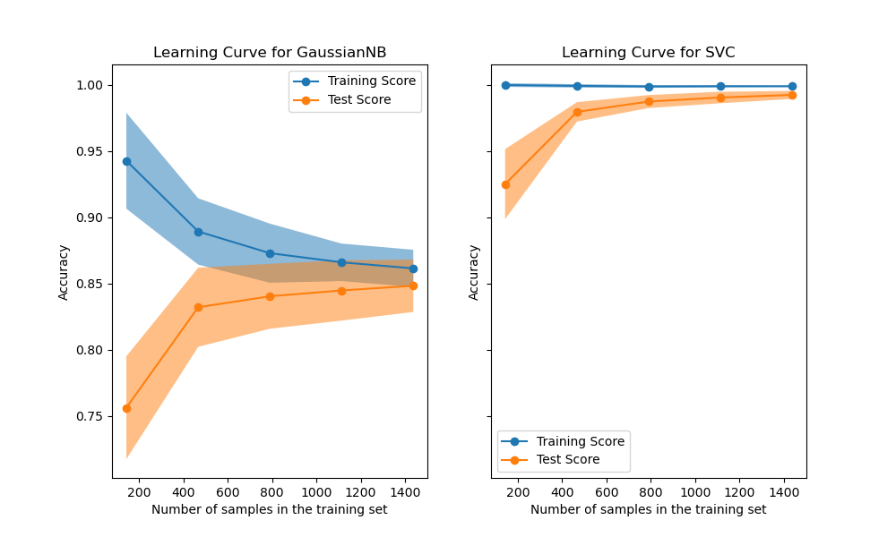
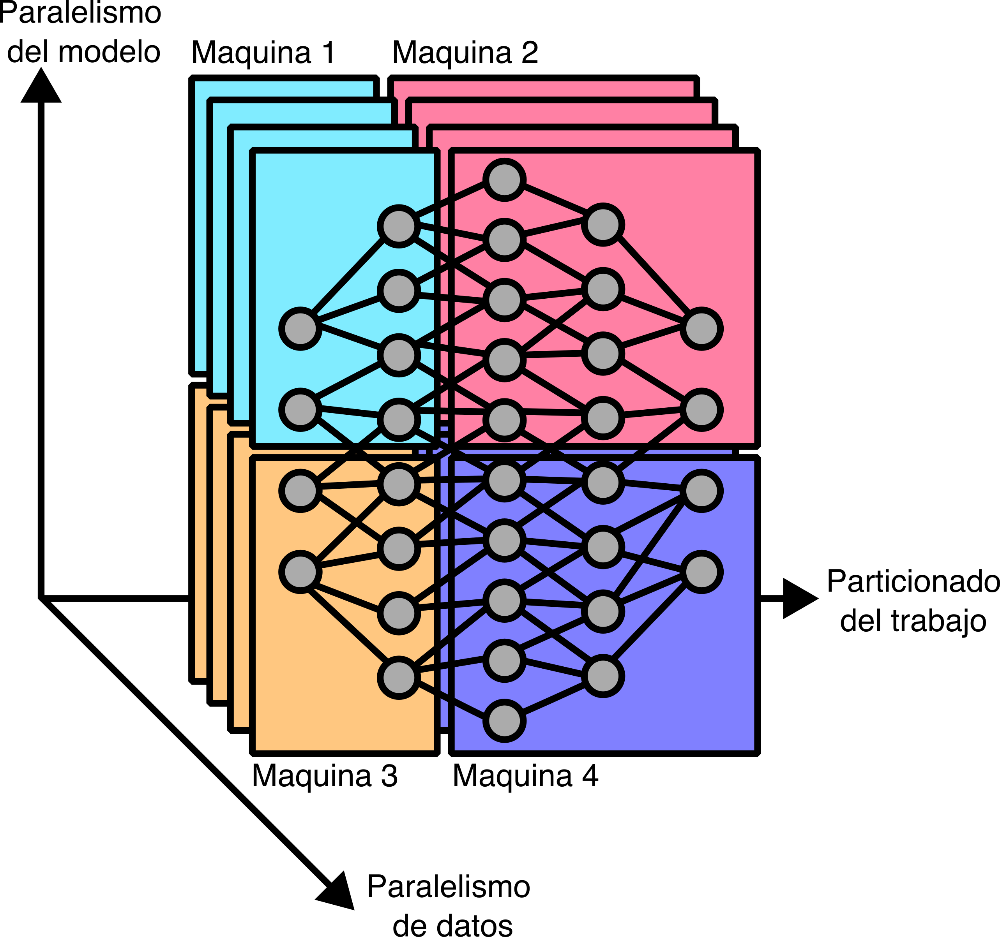
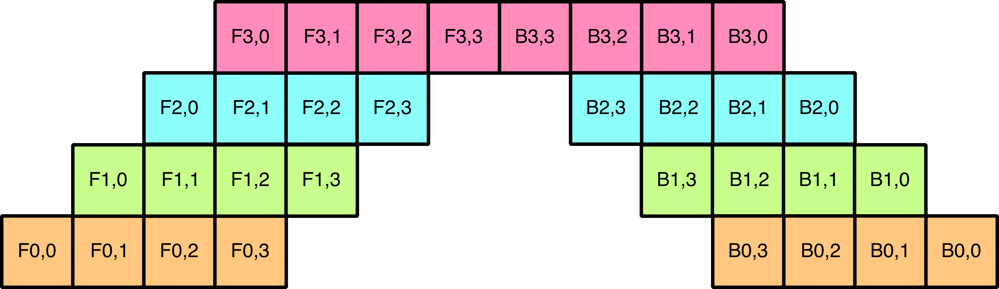
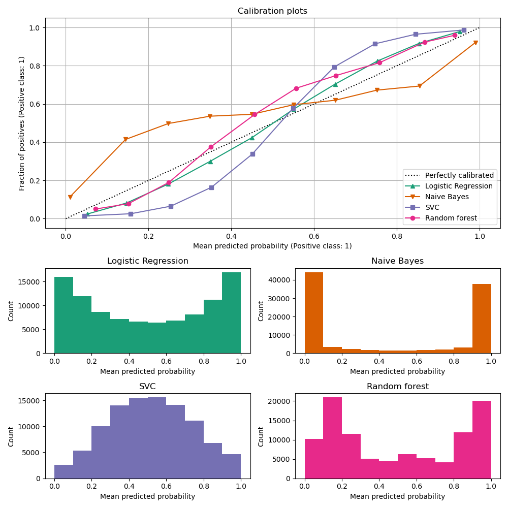
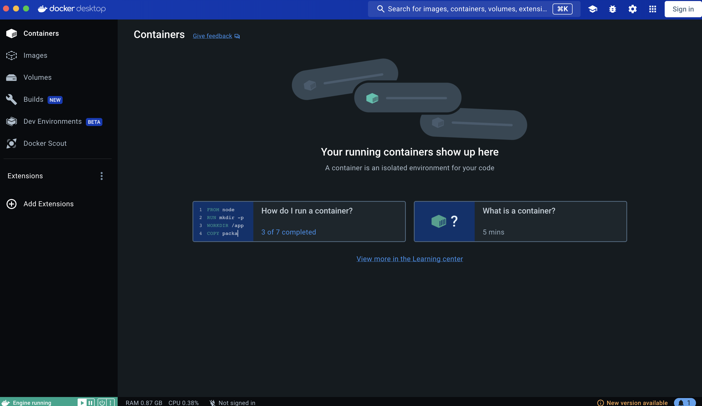

## Diapositiva 1: Desarrollo de modelos

* Operaciones de Aprendizaje Automático I - CEIA - FIUBA

Dr. Ing. Facundo Adrián Lucianna

---

## Diapositiva 2: Repaso de la clase anterior

Operaciones de Aprendizaje Automático I - CESE - FIUBA

---

## Diapositiva 3: Ciclo de vida de un proyecto de Aprendizaje Automático

Problema de negocio

Definición de objetivos

Recolección de datos y preparación

Featureengineering

Evaluación del modelo

Despliegue del modelo

Servicio del modelo

Monitoreo del modelo

Mantenimiento del modelo

Entrenamiento del modelo

---

## Diapositiva 4: Ciclo de vida de un proyecto de Aprendizaje Automático

Data Engineer

Data Scientist

Data Analyst

Machine LearningEngineer

El Data Engineer es responsable de la **preparación y limpieza de los datos**, la creación de **pipelines de datos**y la integración de diferentes fuentes de datos.

Su trabajo también incluye la selección de las herramientas y tecnologías adecuadas para la gestión de datos y la implementación de soluciones de **almacenamiento y procesamiento de datos escalables**.

El Data Scientist se encarga de **definir y crear modelos de machine****learning**que permitan hacer predicciones a partir de los datos. Su trabajo implica seleccionar los algoritmos adecuados, entrenar los modelos y optimizar su rendimiento.

Los Data Scientists también pueden participar en la identificación de variables relevantes y en la **exploración de los datos para encontrar patrones y tendencias.**

El Data Analyst trabaja con datos para descubrir patrones y tendencias que puedan ser útiles para la **toma de decisiones empresariales**. Su trabajo implica realizar análisis estadísticos y visualizaciones de datos para **entenderlos mejor**y hacer recomendaciones sobre cómo pueden utilizarse **para mejorar el negocio.**

El Machine LearningEngineer es responsable de llevar los modelos de machine learning a **producción****y asegurarse de que estén funcionando correctamente.**

Su trabajo implica seleccionar la infraestructura adecuada para el despliegue de los modelos, integrar los modelos con otras aplicaciones y sistemas, y **supervisar el rendimiento de los modelos.**

---

## Diapositiva 5: Consideraciones para aplicaciones en industria

**Producción**

Para que el modelo pueda entregar valor al negocio debe estar productivo.

**Usabilidad**

Un modelo con 70% de exactitud en producción produce mucho más valor que uno con 100% de exactitud que no se puede usar.

**Dependencia**

Los modelos en producción requieren mantenimiento para prevenir el desvío en los datos o en el target.

**Escalabilidad**

El proceso debe ser implementado para que otras personas del equipo lo entiendan, debe ser transparente y replicable.

---

## Diapositiva 6: Pipelines/flujos de trabajo reproducibles dentro de ML

**¿Qué es un pipeline?**

Un pipeline de datos es una construcción lógica que representa un proceso dividido en fases.

Los pipelines de datos se caracterizan por definir el conjunto de pasos o fases y las tecnologías involucradas en un proceso de movimiento o procesamiento de datos.

Esto nos permite encapsular el código, hacerlo más legible, más ordenado, estandarizar y automatizar los procesos, entre otros beneficios.

Los pipelines de Machine Learning permiten a los equipos de datos iterar rápidamente sobre diferentes modelos y

ajustes y mejorar continuamente el rendimiento del modelo.

Los pipelines están conformados por **componentes** y por **artefactos** (artifacts).

---

## Diapositiva 7: Machine Learning Operations (MLOps)

* MLOps es una **disciplina emergente**que se enfoca en la gestión de los modelos de machine learning en producción y busca establecer procesos y herramientas para garantizar que los modelos de machine learning sean precisos, escalables y adaptables a diferentes situaciones.

**MLOps**, o **Machine****Learning****Operations**, es un término que se refiere a las prácticas y herramientas utilizadas para gestionar y desplegar modelos de aprendizaje automático a gran escala en producción de manera efectiva y eficiente.

Imagen obtenida de Neal Analytics

---

## Diapositiva 8: Niveles de MLOps

* Frecuentemente dentro de la industria se pueden encontrar diferenciados tres niveles de MLOps. Estos niveles se diferencian en cuanto a la cantidad de herramientas/prácticas de MLOps que incluyen dentro de su funcionamiento.

* Nivel 0

* Nivel 1

* Nivel 2

Los 3 niveles de MLOps

---

## Diapositiva 9: Buenas prácticas de programación

* Para comenzar a trabajar pensando en un modelo de aprendizaje automático que será productivo, y visto por otras personas, el código debe cumplir con ciertos estándares de buenas prácticas de programación.

* Cuando nuestro código va a ser potencialmente usado en producción, debe cumplir con ser **legible**, **simple** y **conciso**.

---

## Diapositiva 10: Desarrollo de modelos

Operaciones de Aprendizaje Automático I - CESE - FIUBA

---

## Diapositiva 11: Desarrollo de modelos en producción

Problema de negocio

Definición de objetivos

Recolección de datos y preparación

Featureengineering

Evaluación del modelo

Despliegue del modelo

Servicio del modelo

Monitoreo del modelo

Mantenimiento del modelo

Entrenamiento del modelo

---

## Diapositiva 12: Desarrollo de modelos en producción

* En AMq1 vimos diferentes modelos, y estudiamos el proceso para entrenarlo y evaluarlo. Ahora volveremos un poco sobre esto, pero ahora estamos pensando que este modelo no solo terminará en un notebook, sino que llegará a producción.

* El desarrollo de modelos es un proceso iterativo.

* Cada iteración, uno debe comparar el rendimiento con iteraciones anteriores.

---

## Diapositiva 13: Seleccionar el tipo de modelo

Operaciones de Aprendizaje Automático I - CESE - FIUBA

---

## Diapositiva 14: Seleccionar el tipo de modelo

* Si uno tuviese tiempo infinito y recursos infinitos, el camino más racional es evaluar todas las posibles soluciones y ver cuál es la mejor al problema que queremos resolver. Pero no tenemos el tiempo y recursos infinitos, sino que tenemos un presupuesto y un tiempo para desarrollar. Por lo que hay que ser estratégico.

* Un punto importante es enfocarse en modelos apropiados para el problema, y para eso usamos lo que vimos en AMq1.

* Otro punto importante, en general dejado de lado, es **la implementación del modelo**, el cual no solo debemos mirar la métrica de entrenamiento, sino cuanta data, procesamiento y tiempo llevaría entrenarlo. También cuál sería su latencia de inferencia e interoperabilidad.

---

## Diapositiva 15: Seleccionar el tipo de modelo

* Ocho consejos a la hora de seleccionar un modelo:

* **Evitar la trampa del estado del arte**: En general se asume que estos modelos van a ser la mejor solución para el problema, dado que todos están usando ese modelo. No solo eso, a nivel de negocio, “vende” más usar un modelo moderno.

* Que un modelo sea el que tenga un rendimiento mejor que otros en un dataset estático, no significa que el modelo será lo suficientemente rápido o lo suficientemente barato.

* Inclusive tampoco significará que el modelo será mejor que otros modelos con tus datos.

---

## Diapositiva 16: Seleccionar el tipo de modelo

* Ocho consejos a la hora de seleccionar un modelo:

* **Comienza con el modelo más simple**: Dentro del Zen de Python, encontramos:

* Simple es mejor que complejo

* Y este principio es aplicable al desarrollo de modelos. Simplicidad sirve de tres propósitos:

* **Modelos sencillos son más fáciles de desplegar en producción**. Desplegarlo temprano permite validar un pipeline de predicción es consistente con tus datos de entrenamiento.

* Comenzando algo más sencillo y agregando complejidad paso a paso lo hace **más fácil de entender** y de depurar.

* Los modelos más simples sirven como **baseline**.

---

## Diapositiva 17: Seleccionar el tipo de modelo

* Ocho consejos a la hora de seleccionar un modelo:

* **Explicabilidad**: ¿Las predicciones del modelo requieren explicación para una audiencia no técnica? Los modelos de aprendizaje automático más precisos son los llamados **cajas negras**. Cometen muy pocos errores de predicción, pero puede ser difícil de entender, y aún más difícil de explicar, por qué un modelo hizo una predicción específica. Ejemplos de tales modelos son las redes neuronales profundas y los modelos de conjuntos.

* Por el contrario, los algoritmos de aprendizaje de árboles de decisión, kNN y regresión lineal no siempre son los más precisos. Sin embargo, sus predicciones son fáciles de interpretar por parte de un usuario no experto.

---

## Diapositiva 18: Seleccionar el tipo de modelo

* Ocho consejos a la hora de seleccionar un modelo:

* **Velocidades de entrenamiento y predicción**: ¿Cuánto tiempo se le permite usar a un algoritmo de aprendizaje para construir un modelo y con qué frecuencia será necesario volver a entrenar el modelo con datos actualizados? Si el entrenamiento dura dos días y necesita volver a entrenar su modelo cada 4 horas, el modelo nunca estará actualizado. Las bibliotecas especializadas contienen implementaciones muy eficientes de algunos algoritmos. Es posible que prefiera investigar en línea para encontrar dichas bibliotecas.

* ¿Qué tan rápido debe ser el modelo al generar predicciones? ¿Se utilizará el modelo en un entorno de producción donde se requiere un rendimiento muy alto? Modelos como SVM y modelos de regresión lineal y logística, y redes neuronales no muy profundas, son extremadamente rápidos en el momento de la predicción. Otros, como kNN, ensambles y redes neuronales profundas o recurrentes, son más lentos.

---

## Diapositiva 19: Seleccionar el tipo de modelo

* Ocho consejos a la hora de seleccionar un modelo:

* **Evita sesgos humanos en la selección**: Todos tenemos preferencias y gustos sobre ciertos tipos de modelos.

* Si un tipo de modelo nos gusta más, vamos a destinar más tiempo jugando con sus hiperparámetros que otros. Los que nos puede dar la errónea idea de que un modelo es mejor que otro.

* Cuando se compara dos arquitecturas diferentes, es importante compararlo bajo configuraciones similares. Si se ejecutan 100 experimentos en una, no sería justo si se corren un par en otra arquitectura.

* Dado que el rendimiento del modelo depende fuertemente del contexto, es prácticamente **imposible poder asegurar que una arquitectura es mejor que otra**.

---

## Diapositiva 20: Seleccionar el tipo de modelo

* Ocho consejos a la hora de seleccionar un modelo:

* **Evalúa rendimiento de hoy versus rendimiento posterior**: El mejor modelo hoy no necesariamente lo será en dos meses.

* Por ejemplo, un modelo de árbol puede al inicio rendir mejor, pero más adelante con mucha más data acumulada, una red neuronal lo supere.

* Una forma de estimar que tanto puede cambiar el rendimiento en el futuro con más datos es usan **curvas de aprendizaje**.

---

## Diapositiva 21: Seleccionar el tipo de modelo

* Ocho consejos a la hora de seleccionar un modelo:

* **Evalúa rendimiento de hoy versus rendimiento posterior**: El mejor modelo hoy no necesariamente lo será en dos meses.

* Por ejemplo, un modelo de árbol puede al inicio rendir mejor, pero más adelante con mucha más data acumulada, una red neuronal lo supere.

* Una forma de estimar que tanto puede cambiar el rendimiento en el futuro con más datos es usan **curvas de aprendizaje**.

Imagen obtenida de Scikit-Learn

---

## Diapositiva 22: Seleccionar el tipo de modelo

* Ocho consejos a la hora de seleccionar un modelo:

* **Evalúa rendimiento de hoy versus rendimiento posterior**: El mejor modelo hoy no necesariamente lo será en dos meses.

* Por ejemplo, un modelo de árbol puede al inicio rendir mejor, pero más adelante con mucha más data acumulada, una red neuronal lo supere.

* Una forma de estimar que tanto puede cambiar el rendimiento en el futuro con más datos es usan **curvas de aprendizaje**.

* Cuando evalúas modelos, es importante tener en cuenta su potencial de mejoras en el futuro y que tan fácil es lograr estas mejoras.

---

## Diapositiva 23: Seleccionar el tipo de modelo

* Ocho consejos a la hora de seleccionar un modelo:

* **Evalúa****trade-offs**: Hay muchas consideraciones que se deben tomas a la hora de elegir un modelo.

* Una clásica es trade-off de falsos positivos y falsos negativos que vimos en AMq1.

* Requerimientos de cómputos versus exactitud. Un modelo más complejo puede llevar a una alta exactitud, pero requiere una maquina más poderosa para lograr inferencias con buena latencia.

* Rendimiento versus interpretabilidad. Un modelo más complejo puede tener mejores resultados, pero sus resultados son menos interpretables.

---

## Diapositiva 24: Seleccionar el tipo de modelo

* Ocho consejos a la hora de seleccionar un modelo:

* **Entiende las suposiciones del modelo**: Veamos algunas suposiciones,

* Suposiciones de predicción. Cada modelo apunta a predecir una salida Y de una entrada X, hace la suposición de que Y está basado en X.

* IID: En general, lo modelos asumen que los datos de entrenamientos son obtenidos independiente de una misma distribución.

* Suavidad: Cada método supervisado asume que existe un set de funciones que puede transformar la entrada en salida, de tal forma que entradas similares nos da salidas similares.

* Tratabilidad: Todo modelo generativo que una entrada X y una representación latente Z (por ejemplo, componentes principales)  hace la suposición de que el cálculo de la probabilidad es tratable.

---

## Diapositiva 25: Seleccionar el tipo de modelo

* Ocho consejos a la hora de seleccionar un modelo:

* **Entiende las suposiciones del modelo**: Veamos algunas suposiciones,

* Bordes. Un clasificador lineal asume que la frontera de decisión es lineal.

* Independencia condicional: Un clasificador Bayes ingenuo asume que los atributos son independientes entre ellos para una clase dada.

* Distribución normal: Muchos métodos estadísticos asumen que los datos están distribuidos de forma normal.

---

## Diapositiva 26: Las 4 fases del desarrollo de modelos

Operaciones de Aprendizaje Automático I - CESE - FIUBA

---

## Diapositiva 27: Las 4 fases del desarrollo de modelos

* La estrategia que uno debe llevar a la hora de adoptar ML para un problema específico dependerá de en qué fase nos encontremos.

* **Fase 1: Antes de Machine****Learning**

* Si es la primera vez que se quiere intentar realizar un tipo de predicción, comienza con una solución que no involucra un modelo. Lo primero puede ser una simple heurística.

* Por ejemplo, el feed de noticias de Facebook, cuando comenzó en 2006, los post se mostraban de forma cronológica. Recien en 2011, Facebook comenzó a mostrar actualizaciones en base a intereses.

---

## Diapositiva 28: Las 4 fases del desarrollo de modelos

* La estrategia que uno debe llevar a la hora de adoptar ML para un problema específico dependerá de en qué fase nos encontremos.

* **Fase 1: Antes de Machine****Learning**

* Si es la primera vez que se quiere intentar realizar un tipo de predicción, comienza con una solución que no involucra un modelo. Lo primero puede ser una simple heurística.

* Por ejemplo, el feed de noticias de Facebook, cuando comenzó en 2006, los post se mostraban de forma cronológica. Recien en 2011, Facebook comenzó a mostrar actualizaciones en base a intereses.

---

## Diapositiva 29: Las 4 fases del desarrollo de modelos

* La estrategia que uno debe llevar a la hora de adoptar ML para un problema específico dependerá de en qué fase nos encontremos.

* **Fase 2: Modelo de Machine****Learning****más sencillo posible**

* Para el primer modelo, empieza con el más básico posible que le brinde visibilidad de su funcionamiento para validar la utilidad del enfoque del problema y los datos. Casi cualquier modelo de AMq1.

* También son más fáciles de implementar y desplegar, lo que permite crear rápidamente un marco desde la ingeniería de datos hasta el desarrollo.

---

## Diapositiva 30: Las 4 fases del desarrollo de modelos

* La estrategia que uno debe llevar a la hora de adoptar ML para un problema específico dependerá de en qué fase nos encontremos.

* **Fase 3: Optimizar el modelo sencillo**

* Una vez que está productivo el framework del modelo, nos podemos enfocar en optimizar el modelo simple modificando la función objetivo, búsqueda de hiper-parámetros, featureengineering, más datos o ensambles.

---

## Diapositiva 31: Las 4 fases del desarrollo de modelos

* La estrategia que uno debe llevar a la hora de adoptar ML para un problema específico dependerá de en qué fase nos encontremos.

* **Fase 4: Modelos complejos**

* Una vez que se considera que se llegó al límite de los modelos más simples, y el uso de caso lo demanda, se puede experimentar con modelos más complejos.

* Además, va a ser importante experimentar que tan rápido decae un modelo en producción (es decir, cada cuanto hay que re-entrenarlo) para que se construya la infraestructura de entrenamiento.

---

## Diapositiva 32: Depurando modelos

Operaciones de Aprendizaje Automático I - CESE - FIUBA

---

## Diapositiva 33: Depurando modelos

* Un gran problema de los modelos es que cuando fallan, **fallan silenciosamente**. Por lo que la tediosa tarea de depurar, en Aprendizaje Automático es mucho más tedioso.

* Un problema típico es: el código compila, la función de pérdida disminuye como debería, se llaman las funciones correctas, las predicciones se hacen… pero las predicciones están **mal**.Lo peor es que los usuarios no notan error y utilizan las predicciones como si la aplicación estuviera funcionando como debería.

* Una vez que se encuentra el error, es sumamente lento validar si el error se corrigió.

* Recordemos que el trabajo de implementar un modelo es un trabajo inter-disciplinario (datos, etiquetas, features, algoritmo de ML, infraestructura, etc.). Estos componentes pueden ser de equipos diferentes. Una falla puede ser de alguno de estos componentes o de la interacción entre ellos.

---

## Diapositiva 34: Depurando modelos

* Veamos algunas causas típicas de fallas:

* **Restricciones teóricas**: Cada modelo viene con sus propias suposiciones y los datos no cumplieron estas suposiciones.

* **Mala implementación del modelo**: El modelo podría ajustarse bien a los datos, pero los errores están en la implementación del modelo.

* **Elección pobre de****hiperparámetros**:  El modelo se adapta perfectamente a los datos y la implementación es correcta, pero un conjunto deficiente de hiperparámetros puede hacer que el modelo sea inútil.

* **Problemas de data**: Hay muchas cosas que podrían salir mal en la recopilación y el preprocesamiento de datos y que podrían causar que el modelo tenga un rendimiento deficiente.

* **Mala elección de****features**: Hay muchísimas opciones de features, muchas features pueden ocasionar overfitting o causar **data****leakage**.

---

## Diapositiva 35: Depurando modelos

* No hay métodos precisos para depurar, pero podemos ver algunas estrategias para evitar bugs:

* Comienza simple y agrega gradualmente más componentes.

* Una vez que tienes una implementación simple, intenta sobre-entrenarlo con unos pocos datos, y observa si la metrica es casi perfecta. Si el modelo no puede overfittear significará que hay algo raro con la implementación.

* Usa una semilla para la aleatoriedad. Esto permite consistencia entre ejecuciones y facilita la reproducción de errores.

---

## Diapositiva 36: Entrenamiento distribuido

Operaciones de Aprendizaje Automático I - CESE - FIUBA

---

## Diapositiva 37: Entrenamiento distribuido

* A pesar de que se insiste en el uso de modelos sencillos, hay una realidad que ni podemos escapar. Cada vez hay más datos, y cada vez se necesitan modelos más grandes, lo que nos llevan a casos más intensos de recursos.

* El primer problema que vemos en estos casos es que los datos no entran en memoria. Casi todos los problemas de aprendizaje profundo o de visión por computadora entran en esa categoría.

* Cuando los datos no entran en memoria, o no contamos con el procesamiento suficiente, debemos pasar a técnicas de paralelismo.

---

## Diapositiva 38: Entrenamiento distribuido

* **Paralelismo de datos**

* La forma más común de paralelismo es la de datos. Se reparte los datos en muchas maquinas, se entrena el modelo en cada maquina y se acumulan los gradientes.

* El desafío es cómo acumular gradientes de diferentes máquinas de manera precisa y efectiva.

* Hay dos formas de realizar la acumulación de gradientes:

* Descenso de gradiente estocástico sincrónico

* Descenso de gradiente estocástico asincrónico

---

## Diapositiva 39: Entrenamiento distribuido

* **Paralelismo de datos**

Servidor

GPU 0

GPU 255

…

1. Envía SGD

2. Descarga inmediata

del nuevo modelo

1. Envía SGD

Servidor

GPU 0

GPU 255

…

1. Envía SGD

2. Actualiza el nuevo modelo cuando todos termina

Descenso de gradiente estocástico sincrónico

Descenso de gradiente estocástico asincrónico

---

## Diapositiva 40: Entrenamiento distribuido

* **Paralelismo de datos**

* El descenso de gradiente estocástico asincrónico converge, pero requiere muchos más pasos que el descenso de gradiente estocástico sincrónico. Sin embargo, en la práctica cuando el número de parámetros es grande, las actualizaciones de gradiente solo modifican pequeñas fracciones de los parámetros, y es poco probable que dos actualizaciones de diferentes maquinas modifiquen el mismo parámetro.

* En esos casos es preferible usar asincrónico, ya que se tiene el beneficio de la velocidad y no se pierde nada.

---

## Diapositiva 41: Entrenamiento distribuido

* **Paralelismo del modelo**

* Paralelismo del modelo es cuando diferentes componentes del modelo se encuentran en diferentes maquinas.

---

## Diapositiva 42: Entrenamiento distribuido

* **Paralelismo del pipeline**

* La idea clave en este paralelismo es dividir el cálculo en varias partes. Cuando la maquina 1 termina, para el resultado a la maquina 2, y continua con la segunda parte del cálculo y así sucesivamente. La máquina 2 puede ejecutar la primera parte, mientras que la maquina 1 ejecuta su segunda parte del cálculo.

---

## Diapositiva 43: Métodos de evaluación

Operaciones de Aprendizaje Automático I - CESE - FIUBA

---

## Diapositiva 44: Métodos de evaluación

* En AMq1 vimos como evaluar modelos usando sus métricas de rendimiento. Pero en producción tenemos más evaluaciones que nos importan, ya que nuestros modelos deben ser robustos, justos, calibrados y en general tener sentido.

* Veamos algunos métodos de evaluación que nos permitan caracterizar un modelo.

---

## Diapositiva 45: Métodos de evaluación

* **Test de perturbación**

* Idealmente, las observaciones utilizadas para desarrollar el modelo deberían ser lo más similar a las que se encontrará cuando esté funcionando, pero hay casos que no es posible.

* Para tener una idea de cómo será el rendimiento del modelo con dato ruidosos, se puede realizar pequeños cambios en el set de testing para ver como estas perturbaciones afectan el modelo.

* Cuando más sensible a perturbaciones es el modelo, más difícil será de mantener, ya que, si el comportamiento de los usuarios varía un poco, el rendimiento puede cambiar significativamente.

---

## Diapositiva 46: Métodos de evaluación

* **Test de invarianza**

* Ciertos cambios en las entradas del modelo no deberían generar cambios en la salida del modelo. Principalmente en modelos con datos demográficos. Si esto ocurre, es que hay sesgos en el modelo, el cual puede volver inutilizable al mismo, sin importar que tan bueno sea.

* Para evitar estos sesgos, una solución es mantener las entradas iguales, pero cambiar la información sensible para ver si las salidas cambian.

* Mejor aún, en primer lugar, se debería excluir la información confidencial de las funciones utilizadas para entrenar el modelo.

---

## Diapositiva 47: Métodos de evaluación

* **Test de invarianza**

* Ciertos cambios en las entradas del modelo no deberían generar cambios en la salida del modelo. Principalmente en modelos con datos demográficos. Si esto ocurre, es que hay sesgos en el modelo, el cual puede volver inutilizable al mismo, sin importar que tan bueno sea.

* Para evitar estos sesgos, una solución es mantener las entradas iguales, pero cambiar la información sensible para ver si las salidas cambian.

* Mejor aún, en primer lugar, se debería excluir la información confidencial de las funciones utilizadas para entrenar el modelo.

---

## Diapositiva 48: Métodos de evaluación

* **Test de expectativa direccional**

* Ciertos cambios en las entradas del modelo deberían generar cambios predecibles en la salida del modelo.

* Por ejemplo, para un modelo para predecir precios de casas, mantener todo fijo menos incrementar el tamaño del terreno, no debería reducir el precio predicho.

* En aquellas cosas que conocemos del problema, un cambio de salida en la dirección contraria a la esperada puede significar que el modelo no está aprendiendo lo correcto.

---

## Diapositiva 49: Métodos de evaluación

* **Calibración del modelo**

* Si un modelo hace una predicción de que algo sucederá con una probabilidad del 70%. Lo que esta predicción significa es que de todas las veces que se hace esta predicción, el resultado previsto coincide con el resultado real el 70% de las veces.

* Si un modelo predice que el equipo A vencerá al equipo B con un 70% de probabilidad, y de las 1000 veces que estos dos equipos juegan juntos, el equipo A solo gana el 60% de las veces, entonces decimos que este modelo no está calibrado.

* Un modelo calibrado **debería predecir**que el equipo A gana con un 60% de probabilidad.

---

## Diapositiva 50: Métodos de evaluación

* **Calibración del modelo**

* ¿Por qué esto es importante?

* Supongamos que hay que construir un modelo para predecir la probabilidad de que un usuario haga clic en un anuncio. Dos anuncios A y B.

* El modelo construido predice que un usuario hará click un 10% en el anuncio A, y un 8% en el B.

* No se necesita calibrar el modelo para saber que el usuario, más probablemente haga click en A, pero sí importa si se quiere predecir cuantos clicks se obtendrían en total.

* Si el modelo predice que un usuario hará click en A con un 10% de probabilidad, pero en realidad lo hace un 5%, el número estimado estuvo muy equivocado.

---

## Diapositiva 51: Métodos de evaluación

* **Calibración del modelo**

* Para medir la calibración del modelo, un método simple es contar el número de veces que el modelo tiene una salida A y la frecuencia B de que la predicción fue correcta y luego se grafica A vs. B. Un modelo perfectamente calibrado, A y B es igual en cada parte.

* En **scikit****—****learn**, se puede graficar la curva de calibración de un clasificador binario con el método **sklearn.calibration.calibration_curve**.

---

## Diapositiva 52: Métodos de evaluación

* **Calibración del modelo**

* Para medir la calibración del modelo, un método simple es contar el número de veces que el modelo tiene una salida A y la frecuencia B de que la predicción fue correcta y luego se grafica A vs. B. Un modelo perfectamente calibrado, A y B es igual en cada parte.

* En **scikit****—****learn**, se puede graficar la curva de calibración de un clasificador binario con el método **sklearn.calibration.calibration_curve**.

---

## Diapositiva 53: Métodos de evaluación

* **Medición de confianza**

* La medición de la confianza puede considerarse una forma de pensar en el umbral de utilidad para cada predicción individual.

* Mostrar indiscriminadamente todas las predicciones de un modelo a los usuarios, incluso las predicciones de las que el modelo no está seguro pueden causar molestias y hacer que los usuarios pierdan la confianza en el sistema.

* La medición de la confianza es una métrica para cada muestra individual. Las métricas a nivel de muestra son cruciales cuando importa el rendimiento del sistema en cada muestra.

MinorityReport (2002) – DreamWorks Pictures

---

## Diapositiva 54: Métodos de evaluación

* **Medición basada en rangos**

* Separar sus datos en subconjuntos y observar el rendimiento de su modelo en cada subconjunto por separado es una forma de evaluar de forma más completa al modelo que una métrica general como la exactitud.

* Veamos un ejemplo, tenemos un dataset con dos subgrupos (90% el mayoritario) y tenemos dos modelos que:

---

## Diapositiva 55: Métodos de evaluación

* **Medición basada en rangos**

* Separar sus datos en subconjuntos y observar el rendimiento de su modelo en cada subconjunto por separado es una forma de evaluar de forma más completa al modelo que una métrica general como la exactitud.

* Veamos un ejemplo, tenemos un dataset con dos subgrupos (90% el mayoritario) y tenemos dos modelos que:

**En métricas general es mejor el modelo A**

---

## Diapositiva 56: Métodos de evaluación

* **Medición basada en rangos**

* La medición de rango es importante por la paradoja de Simpson:

* Una tendencia que aparece en varios grupos de datos desaparece cuando estos grupos se combinan y en su lugar aparece la tendencia contraria para los datos agregados.

* En nuestro caso, el modelo A tiene mejor rendimiento que el modelo B en general, pero el modelo B rinde mejor cuando consideramos a cada grupo por separado.

---

## Diapositiva 57: Desplegado de modelos

Operaciones de Aprendizaje Automático I - CESE - FIUBA

---

## Diapositiva 58: Desplegado de modelos

* Una vez desarrollado el modelo, llega el momento de desplegarlo en producción. En siguientes clases veremos en más detalle diferentes modos de desplegado.

* Ahora nos importa saber la tecnología que el modelo será desplegado. Lo que conocemos como producción es un espectro:

* Puede ser tan simple como generar lindo gráficos en una notebook para mostrar a ejecutivos

* Como el mantener cientos de modelos actualizados, los cuales sirven a millones de personas.

* Lo que, dejando de lado el caso más simple, una forma de facilitar el desplegado es asegurarse que el código que nos anda bien en nuestra maquina funciones en donde esté productivo, y que, además, sea fácil de escalar y de estandarizar el stack de tecnología.

* Una forma de realizar esto es mediante **contenedores**.

---

## Diapositiva 59: Contenedores y Docker

Operaciones de Aprendizaje Automático I - CESE - FIUBA

---

## Diapositiva 60: Contenedores y Docker

* El concepto de contenedores va de la mano de microservicios. Si tenemos servicio grande, podemos romperlo en servicios más pequeños, donde cada servicio se comunica con otros mediante la red.

* Un desarrollo de Aprendizaje automático está dividido en partes, como ingesta, preparación, combinación, separación, entrenamiento, evaluación, inferencia, pos-procesamiento y monitoreo, el modelo de microservicios se ajusta perfectamente.

Ingesta de datos

Preparación de datos

Entrenamiento

Inferencia

Monitoreo

Monitoreo

Inferencia

Entrenamiento

Entrenamiento

Preparación de datos

Ingesta de datos

Monolítico

Microservicios

---

## Diapositiva 61: Contenedores y Docker

* Un problema de microservicios es que cada servicio es independiente, y eso genera mucha redundancia. Cada uno de ellos requeriría una máquina virtual con un sistema operativo instalado, librarías y binarios + recursos de CPU y memoria, inclusive si el servicio no está funcionando al 100%.

* Aquí es donde aparecen los **contenedores**.

* Los contenedores son una unidad estándar de software que empaqueta código y todas sus dependencias para que la aplicación se ejecute de manera rápida y confiable de un entorno a otro.

---

## Diapositiva 62: Contenedores y Docker

Docker

Sistema operativo del Host

Infraestructura

Guest OS

App B

App A

Infraestructura

Sistema operativo del Host

Hipervisor

Guest OS

Guest OS

App A

App B

App C

App C

---

## Diapositiva 63: Contenedores y Docker

* ¿Por qué usar Contenedores para aplicaciones de Machine Learning?

* Estandarización del entorno productivo.

* Es fácil de reproducir en diferentes sistemas operativos.

* Es fácil de desplegar en clusters o en la nube.

* Es fácil de versionar, al mantener diferentes imágenes de contenedores y un software de versionado.

* Es fácil de integrar en sistema heterogéneos. Normalmente usamos Python para ML, el resto de las cosas no.

---

## Diapositiva 64: Docker

* Veamos en más detalle a la solución de Docker, para ello presentemos algunos términos:

* **Dockerfile**: Cada contenedor de Docker comienza con un archivo de texto conteniendo las instrucciones de cómo construir la imagen de contenedor. Es en esencia una lista de comandos de consola que el motor de Docker ejecutará para armar la imagen.

* **Imagen de Docker:**Las imágenes de Docker contiene el código fuente, como asi también las librerías y dependencias que la aplicación necesita para funcionar. Cuando se ejecuta la imagen, se vuelve una instancia del contenedor.Es posible de crear una imagen de cero, pero es común usar capas bajo imágenes públicas.

* **Contenedor de Docker:**Los contenedores son las instancias corriendo de las imágenes.

* **Docker Hub:**Es el repositorio público de imágenes de Docker.

* **Docker Desktop:**Es una aplicación que incluye el motor de Docker, Docker CLI, Docker Compose, etc.

* **Docker Daemon:**Es el servicio que crea y administra las imágenes.

---

## Diapositiva 65: Docker

* Instalemos Docker en nuestras computadoras, para ello vamos a https://www.docker.com/products/docker-desktop/ donde podemos descargar Docker Desktop.

* Usuarios de Linux, instalen Docker usando su gestor de paquetes, y para tener una herramienta similar a Docker Desktop, pueden usar Podman.

* Para usuarios de Ubuntu: https://docs.docker.com/engine/install/ubuntu/

* Si quieren aprender más en detalle, visiten la guía https://docs.docker.com/build/guide/

---

## Diapositiva 66: Docker

* Instalemos Docker en nuestras computadoras, para ello vamos a https://www.docker.com/products/docker-desktop/ donde podemos descargar Docker Desktop.

* Usuarios de Linux, instalen Docker usando su gestor de paquetes, y para tener una herramienta similar a Docker Desktop, pueden usar Podman.

---

## Diapositiva 67: Docker Compose

* Cuando tenemos muchos contenedores y queremos que se ejecuten todos juntos, podemos usar a Docker Compose.

* Supongamos que tenemos varias imágenes de microservicios, y queremos levantar a todos los servicios juntos. Cada una tiene un **Dockerfile**, para integrarlas a todas, ahora debemos crear un archivo YAML llamado **docker-compose.yaml**.

* En este archivo podemos definir las imágenes que queremos utilizar, la exposición de los puertos, volúmenes (permite persistir información una vez que el contenedor está apagado).

* Realicemos un Hands-on de contenedores de Docker…