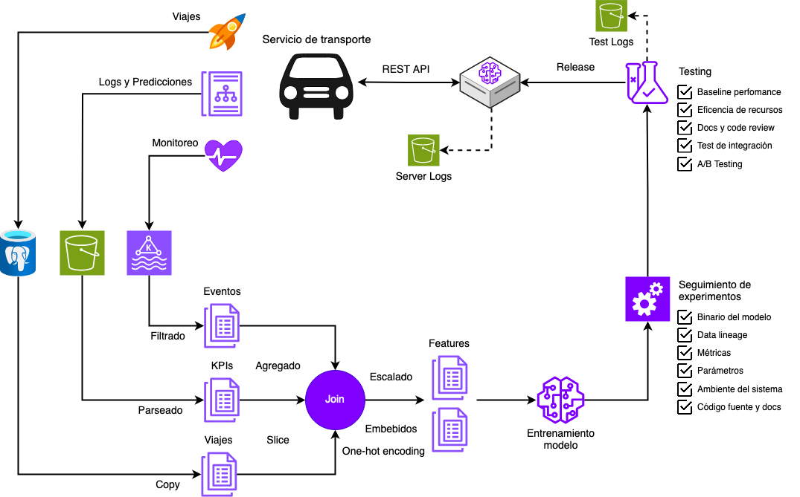
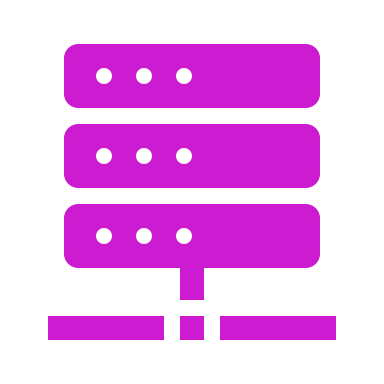

## Diapositiva 1: Infraestructura y herramientas de MLOps

* Operaciones de Aprendizaje Automático I - CEIA - FIUBA

Dr. Ing. Facundo Adrián Lucianna

---

## Diapositiva 2: Repaso de la clase anterior

Operaciones de Aprendizaje Automático I - CESE - FIUBA

---

## Diapositiva 3: Seleccionar el tipo de modelo

* Ocho consejos a la hora de seleccionar un modelo:

* **Evitar la trampa del estado del arte**

* **Comienza con el modelo más simple**

* **Explicabilidad**

* **Velocidades de entrenamiento y predicción**

* **Evita sesgos humanos en la selección**

* **Evalúa rendimiento de hoy versus rendimiento posterior**

* **Evalúa****trade-offs**

* **Entiende las suposiciones del modelo**

---

## Diapositiva 4: Las 4 fases del desarrollo de modelos

* La estrategia que uno debe llevar a la hora de adoptar ML para un problema específico dependerá de en qué fase nos encontremos.

* **Fase 1: Antes de Machine****Learning**

* **Fase 2: Modelo de Machine****Learning****más sencillo posible**

* **Fase 3: Optimizar el modelo sencillo**

* **Fase 4: Modelos complejos**

---

## Diapositiva 5: Las 4 fases del desarrollo de modelos

* La estrategia que uno debe llevar a la hora de adoptar ML para un problema específico dependerá de en qué fase nos encontremos.

* **Fase 1: Antes de Machine****Learning**

* **Fase 2: Modelo de Machine****Learning****más sencillo posible**

* **Fase 3: Optimizar el modelo sencillo**

* **Fase 4: Modelos complejos**

---

## Diapositiva 6: Ensambles

* Un método que ha demostrado una mejora constante en el rendimiento es utilizar **un conjunto de múltiples modelos**en lugar de solo un modelo individual para hacer predicciones. Cada modelo del conjunto se denomina base learner. La predicción final es a través de un voto de mayoria.

* En general no son elegidos para llevar a producción porque son más difíciles de desplegar y de mantener. Sin embargo, para aquellos casos que una **mejora en rendimiento pequeña puede llevar a una gran ganancia financiera**, es importante considerarlos. Un ejemplo sería un modelo de predicción de la tasa de clicks para Ads.

---

## Diapositiva 7: Depurando modelos

* Veamos algunas causas típicas de fallas:

* **Restricciones teóricas**: Cada modelo viene con sus propias suposiciones y los datos no cumplieron estas suposiciones.

* **Mala implementación del modelo**: El modelo podría ajustarse bien a los datos, pero los errores están en la implementación del modelo.

* **Elección pobre de****hiperparámetros**:  El modelo se adapta perfectamente a los datos y la implementación es correcta, pero un conjunto deficiente de hiperparámetros puede hacer que el modelo sea inútil.

* **Problemas de data**: Hay muchas cosas que podrían salir mal en la recopilación y el preprocesamiento de datos y que podrían causar que el modelo tenga un rendimiento deficiente.

* **Mala elección de****features**: Hay muchísimas opciones de features, muchas features pueden ocasionar overfitting o causar **data****leakage**.

---

## Diapositiva 8: Métodos de evaluación

* Los métodos de evaluación que vimos que son imporantes cuando llevamos modelos a producción:

* **Test de perturbación**

* **Test de invarianza**

* **Test de expectativa direccional**

* **Calibración del modelo**

* **Medición de confianza**

* **Medición basada en rangos**

---

## Diapositiva 9: Infraestructura

Operaciones de Aprendizaje Automático I - CESE - FIUBA

---

## Diapositiva 10: Infraestructura

* Como hemos estados mencionados en clases anteriores, sistemas de ML son complejos.

* La infraestructura, cuando se configura correctamente, puede ayudar a **automatizar procesos**, reduciendo la necesidad de conocimientos especializados y tiempo de ingeniería. Esto, a su vez, puede **acelerar el desarrollo y la entrega de aplicaciones de aprendizaje automático**, reducir la cantidad de errores y permitir nuevos casos de uso.

* Cuando se configura **mal**, la infraestructura es difícil de utilizar y costosa de reemplazar.

---

## Diapositiva 11: Infraestructura

* La infraestructura de cada empresa o negocio es diferente. Esta dependerá de la cantidad de aplicaciones que se desarrollen y cuanto especializadas son estas.

Inversión en

Infraestructura

Escala de

producción

Una ML

app

Muchas ML

app

Sirviendo

millones de

requests/hr

Infraestructura

generalizada

No necesita

infraestructura

Infraestructura

muy especializada

---

## Diapositiva 12: Infraestructura

* Vengo diciendo Infraestructura esto, infraestructura lo otro... Pero ¿qué es infraestructura?

---

## Diapositiva 13: Infraestructura

* Vengo diciendo Infraestructura esto, infraestructura lo otro... Pero ¿qué es infraestructura?

* **Almacenamiento y computo:**La capa de almacenamiento es donde los datos se colectan y guardan. La capa de cómputo es quien provee del poder de computación para tareas de ML.

* **Administración de recursos:**Son herramientas de orquestación, y de sincronismos para hacer que cargar el trabajo en la capa de cómputo para aprovechar al máximo los recursos informáticos. Ejemplo: Airflow, Kubeflow y Metaflow

* **Plataformas de ML:**Son herramientas que ayudan al desarrollo de aplicaciones de ML, tales como registro de modelos, de features y herramientas de monitoreo. Ejemplos: AWS SageMaker y Mlflow.

* **Ambiente de desarrollo:**Es donde el código es escrito y donde corren experimentos. El código necesita ser versionado y testeado. Es necesario realizar seguimiento de experimentos.

---

## Diapositiva 14: Infraestructura

Ambiente de desarrollo

Ej. IDE, Git, CI/CD

Plataformas de ML

Ej. Registro de modelos, monitoreo

Administración de recursos.

Ej. Orquestador de flujo de trabajo

Capa de cómputo y almacenamiento

Ej. AWS EC2/S3, GCP, Snowflake

Más vendibles

Más importantes para

Data Scientist

---

## Diapositiva 15: Capa de Almacenamiento

Operaciones de Aprendizaje Automático I - CESE - FIUBA

---

## Diapositiva 16: Capa de Almacenamiento

* Un sistema de ML puede trabajar con datos de muchas fuentes de datos diferentes. Estas tienen diferentes características, pueden usarse para diferentes propósitos y requieren diferentes métodos de procesamiento.

* Podemos intentar categorizar las fuentes de datos:

* **Datos de entrada de usuario:**Data explícitamente ingresada por los usuarios. Estos pueden imágenes, texto, videos y archivos enviados. Si hay una posibilidad remota que el usuario cargue datos con error, con total seguridad va a ocurrir. Entonces, toda data de carga de usuario requiere más tareas pesadas de control de chequeo y procesamiento. Pero además los usuarios tienen muy poca paciencia, por lo que además se necesita procesamiento rápido.

---

## Diapositiva 17: Capa de Almacenamiento

* Un sistema de ML puede trabajar con datos de muchas fuentes de datos diferentes. Estas tienen diferentes características, pueden usarse para diferentes propósitos y requieren diferentes métodos de procesamiento.

* Podemos intentar categorizar las fuentes de datos:

* **Datos generados por sistemas:**Esto es datos generados por diferentes partes de los sistemas, lo cual incluye logs y salida como las predicciones de los modelos. El principal propósito es visibilidad para debbugear y mejorar la aplicación. En general no se usa esto, pero es vital cuando algo se está prendiendo **fuego**. Los requerimientos de estos datos son muchos más bajos, se procesan diariamente/mensualmente y no tiene tanto procesamiento para corregir ya que se genera automáticamente.

---

## Diapositiva 18: Capa de Almacenamiento

* Un sistema de ML puede trabajar con datos de muchas fuentes de datos diferentes. Estas tienen diferentes características, pueden usarse para diferentes propósitos y requieren diferentes métodos de procesamiento.

* Podemos intentar categorizar las fuentes de datos:

* **Datos del comportamiento de usuarios:**El sistema también genera datos para registrar los comportamientos de los usuarios, como hacer clic, elegir una sugerencia, desplazarse, hacer zoom, ignorar una ventana emergente o pasar una cantidad inusual de tiempo en determinadas páginas. Aunque se trata de datos generados por el sistema, todavía se consideran parte de los datos del usuario y pueden estar sujetos a regulaciones de privacidad.

---

## Diapositiva 19: Capa de Almacenamiento

* Un sistema de ML puede trabajar con datos de muchas fuentes de datos diferentes. Estas tienen diferentes características, pueden usarse para diferentes propósitos y requieren diferentes métodos de procesamiento.

* Podemos intentar categorizar las fuentes de datos:

* **Bases de datos internas:**Es donde se guardan los activos del servicio, como el inventariado, usuarios, etc.

---

## Diapositiva 20: Capa de Almacenamiento

* Un sistema de ML puede trabajar con datos de muchas fuentes de datos diferentes. Estas tienen diferentes características, pueden usarse para diferentes propósitos y requieren diferentes métodos de procesamiento.

* Podemos intentar categorizar las fuentes de datos:

* **Third****party****data:**First-party data son los datos de uno. Second-party data son los datos recopilados por otra empresa sobre sus propios clientes y que ponen a disposición, aunque probablemente hay que pagar por ellos. Thirdparty data son datos sobre el público que no son clientes directos.

* Datos de todo tipo se puede comprar, tales como actividades de las actividades en las redes sociales, el historial de compras, los hábitos de navegación web, el alquiler de automóviles y la inclinación política de diferentes grupos demográficos se vuelven tan granulares como por ejemplo hombres, de 25 a 34 años, que trabajan en tecnología y viven en el Bogotá.

* A veces los datos se pueden **scrappear**.

---

## Diapositiva 21: Capa de Almacenamiento

* Dado que los datos provienen de múltiples fuentes con diferentes patrones de acceso, almacenarlos no siempre es sencillo y, en algunos casos, puede resultar costoso.

* Es importante pensar en cómo se utilizarán los datos en el futuro para que el formato que utilice tenga sentido. Estas son algunas de las preguntas que son importante considerar:

* ¿Cómo almaceno datos multimodales, por ejemplo, una muestra que puede contener imágenes y textos?

* ¿Dónde almaceno mis datos para que sean económicos y de fácil acceso?

* ¿Cómo almaceno modelos complejos para que puedan cargarse y ejecutarse correctamente en hardware diferente?

**Formatos de datos**

---

## Diapositiva 22: Capa de Almacenamiento

* El proceso de convertir una estructura de datos o el estado de un objeto a un formato que pueda almacenarse o transmitirse y reconstruirse posteriormente es lo que se conoce como la **serialización de datos**.

* Al considerar un formato con el que trabajar, hay que considerar diferentes características, como la legibilidad humana, los patrones de acceso y si está basado en texto o binario, lo que influye en el tamaño de los archivos.

**Formatos de datos**

---

## Diapositiva 23: Capa de Almacenamiento

* **CSV**

* Los archivos CSV son un tipo de documento en formato abierto sencillo para representar datos en forma de tabla, en las que las columnas se separan por comas y las filas por saltos de línea.

* Los datos son almacenados y recuperados de fila a fila.

**Formatos de datos**

**JSON**

La mayoría de los lenguajes de programación modernos pueden generar y analizar JSON. Es legible por humanos. Su paradigma de par clave-valor es simple pero poderoso, capaz de manejar datos de diferentes niveles de estructuración.

Su principal desventaja que es una vez que se define una estructura, es muy difícil cambiarla.

---

## Diapositiva 24: Capa de Almacenamiento

* **CSV**

* firstName,lastName,age,streetAddress

* Carlos,Pérez,20,Rivadavia

* Viviana,Llamas,29,Calle 13

**Formatos de datos**

**JSON**

{

“firstName”: “Carlos”,

“lastName”: “Pérez”,

“age”: 20,

“address”: {

“streetAddress”: “Rivadavia”,

“city”: “Rosario”,

“country”:“Argentina”

}

}

---

## Diapositiva 25: Capa de Almacenamiento

**Formato de fila principal versus formato de columna principal**

* Los dos formatos que son comunes y representan dos paradigmas distintos son CSV y Parquet.

* CSV (valores separados por comas) es de fila principal, lo que significa que los elementos consecutivos de una fila se almacenan uno al lado del otro en la memoria.

* Parquet es una columna principal, lo que significa que los elementos consecutivos de una columna se almacenan uno al lado del otro.

* Dado la forma que una computadora accede a los datos tiende a ser más eficiente accediendo de forma secuencial, si se usa un formato de fila principal, será más rápido acceder a filas que a columnas.

---

## Diapositiva 26: Capa de Almacenamiento

**Formato de fila principal versus formato de columna principal**

Columna principal:

Datos son guardados y recuperados de columna a columna

Bueno para acceder a features

Fila principal:

Datos son guardados y recuperados de fila a fila

Bueno para acceder a observaciones

---

## Diapositiva 27: Capa de Almacenamiento

**Formato de fila principal versus formato de columna principal**

* Los formatos de columnas principales permiten lecturas flexibles basadas en columnas, especialmente si sus datos son grandes y tienen miles, sino millones, de features.

* Por ejemplo, si se tienen datos de transacciones de viajes que tienen 1000 features, y solo queremos acceder a hora, ubicación, distancia y precio. Con el formato de columna principal, es relativamente sencillo recuperar estos cuatros features.

* En cambio, en formato de fila principal, si no se conocen los tamaños de las filas, se tendrá que leer todas las columnas y luego filtrar hasta estas cuatro columnas.

* Los formatos de fila principal permiten escrituras de datos más rápidas. Por ejemplo, la situación en la que tiene que seguir agregando nuevos ejemplos individuales a sus datos. Para cada observación individual, sería mucho más rápido escribirlo en un archivo donde sus datos ya estén en formato de fila principal.

* En general, los formatos de filas principales son mejores cuando hay que realizar muchas escrituras, mientras que los formatos de columnas principales son mejores cuando hay que realizar muchas lecturas basadas en columnas.

---

## Diapositiva 28: Capa de Almacenamiento

**Numpy****vs Pandas**

* Un punto importante que a veces pasamos por alto es que Pandas está construido para ser columna principal, mientas que Numpy uno puede especificar.

* Veamos un pequeño ejemplo…

---

## Diapositiva 29: Capa de Almacenamiento

**Archivo de texto versus binario**

* CSV y JSON son archivos de textos, mientras que Parquet son binarios. Los archivos de textos en general son archivos legibles por humanos.  El termino archivo binario es un término paragua para todo archivo que no tiene caracteres y están destinados a ser utilizados por programas que saben cómo entender estos bytes.

* El solo hecho de usar números binarios en vez de caracteres, va a hacer más compacto. En la notebook de recién también tenemos un ejemplo de diferencia de tamaño entre un CSV y un parquet.

* AWS recomienda utilizar el formato Parquet porque "el formato Parquet se carga hasta 2 veces más rápido y consume hasta 6 veces menos almacenamiento en Amazon S3, en comparación con los formatos de texto".

---

## Diapositiva 30: Capa de Almacenamiento

**Modelos de datos**

* Los modelos de datos describen como los datos son representados. La forma en que elija representar los datos no solo afecta la forma en que se construyen sus sistemas, sino también los problemas que sus sistemas pueden resolver.

---

## Diapositiva 31: Capa de Almacenamiento

**Modelos de datos – Modelo relacionales**

* En este modelo, los datos se organizan en relaciones; cada relación es un conjunto de tuplas. Una tabla es una representación visual aceptada de una relación, y cada fila de una tabla forma una tupla.

* Las relaciones están desordenadas. Puedes cambiar el orden de las filas o el orden de las columnas en una relación y seguirá siendo la misma relación. Los datos que siguen el modelo relacional suelen almacenarse en formatos de archivo como CSV o Parquet.

Columna desordenada

Fila desordenada

---

## Diapositiva 32: Capa de Almacenamiento

**Modelos de datos – NoSQL**

* El modelo de datos relacionales se ha podido generalizar a muchos casos de uso, desde comercio electrónico hasta finanzas y redes sociales. Sin embargo, para determinados casos de uso, este modelo puede resultar restrictivo. Por ejemplo, exige que sus datos sigan un esquema estricto y la gestión del esquema es complicada. Veamos dos tipos:

* **Modelo de documento:**Un documento suele ser un string, codificada como JSON, XML o un formato binario. Se supone que todos los documentos de una base de datos de documentos están codificados en el mismo formato. Cada documento tiene una clave única que representa ese documento, que puede usarse para recuperarlo.

* **Modelo de grafo:**Un grafo consiste en nodos y conexiones, donde cada conexión representa una relación entre nodos. En este tipo de modelo, la relación entre nodos es la prioridad. Este tipo de modelos son muy útiles para redes sociales.

---

## Diapositiva 33: Capa de Almacenamiento

**Procesos ETL**

* Cuando los datos se extraen de diferentes fuentes, primero se transforman al formato deseado antes de cargarlos en el destino de destino, como una base de datos o un almacén de datos. Este proceso se llama **E****T****L**, que significa **E**xtract, **T**ransform y **L**oad. Este tipo de procesos es sumamente relevante en ML.

Extract

Transform

Load

Data warehouse

Database

---

## Diapositiva 34: Capa de Almacenamiento

**Procesos ELT**

* A medida que la cantidad de datos empezó a crecer y el almacenamiento a hacerse más barato, es muy común encontrar **data****lakes**, en donde se guardan los datos tal como se encuentran. Este proceso se llama **ELT** (extract, load, transform). Este paradigma permite el arribo rápido de datos dado que casi no hay procesamiento.

Extract

Transform

Load

Data lake

---

## Diapositiva 35: Capa de Almacenamiento

**Flujo de datos**

* La mayoría de las veces, en producción, no hay un solo proceso sino múltiples funcionando en conjunto. ¿Cómo pasamos datos entre diferentes procesos que no comparten memoria?

* Hay básicamente tres modos (que cada de uno de ellos tienen sus variantes):

* **Datos que pasan a través de bases de datos**: Esta es la forma más fácil de pasar información. Un proceso A escribe en una base de datos lo que quiere enviar, y el proceso B lee la base de datos.

* Este modo tiene dos problemas:

* Requiere que ambos servicios accedan a la misma base de datos. Esto no es posible si dos servicios son de empresas diferentes.

* Leer y escribir en una base de datos puede agregar demasiada latencia para ciertos procesos.

---

## Diapositiva 36: Capa de Almacenamiento

**Flujo de datos**

* La mayoría de las veces, en producción, no hay un solo proceso sino múltiples funcionando en conjunto. ¿Cómo pasamos datos entre diferentes procesos que no comparten memoria?

* Hay básicamente tres modos (que cada de uno de ellos tienen sus variantes):

* **Datos que pasan a través de servicios**: Esta forma es pasar información a través de la red. Un proceso A envía un request al proceso B que especifica los datos que necesita, y B se lo retorna. Este método funciona bien con comunicaciones de servicios de empresas diferentes o en una estructura de microservicios, a comunicarse entre ellos.

* Los estilos de solicitudes más populares utilizados para pasar datos a través de redes son REST (transferencia de estado representacional) y RPC (llamada a procedimiento remoto).

---

## Diapositiva 37: Capa de Almacenamiento

**Flujo de datos**

* La mayoría de las veces, en producción, no hay un solo proceso sino múltiples funcionando en conjunto. ¿Cómo pasamos datos entre diferentes procesos que no comparten memoria?

* Hay básicamente tres modos (que cada de uno de ellos tienen sus variantes):

* **Datos que pasan a través de transporte en tiempo real**: Cuando el número de servicios empieza a incrementar, una comunicación mediante API comienza a ser inmanejable y empieza a ver un exceso de envíos de mensajes. El paso de datos basado en solicitudes es sincrónico: el servicio de destino tiene que escuchar la solicitud para que se realice.

* Una forma de evitar esto, es usar un bróker que se encargue de coordinar el pasaje de información.

---

## Diapositiva 38: Capa de Almacenamiento

**Flujo de datos**

Broker

Servicio A

Servicio B

Servicio C

---

## Diapositiva 39: Capa de Cómputo

Operaciones de Aprendizaje Automático I - CESE - FIUBA

---

## Diapositiva 40: Capa de Cómputo

* La capa de cómputo se refiere a todos los recursos informáticos a los que se tiene acceso y al mecanismo para determinar cómo se pueden utilizar estos recursos.

* La cantidad de recursos informáticos disponibles determina la escalabilidad de las cargas de trabajo. Se puede pensar en la capa de cómputo como el motor para ejecutar los trabajos. En su forma más simple, la capa de cómputo puede ser simplemente un único núcleo de CPU o un núcleo de GPU que realiza todos los cálculos. Su forma más común es la computación en la nube administrada por un proveedor de la nube como AWS EC2 o GCP.

---

## Diapositiva 41: Capa de Cómputo

* Una ventaja de trabajar en la nube, aunque es posible realizarlo on-premise, es el escalamiento, en donde tenemos:

* **Escalamiento vertical**

  * Escalamiento dentro de un mismo  servidor.

  * Implica incrementar la capacidad de un Servidor agregando más recursos de CPU, memoria y de almacenamiento.

**Escalamiento**

---

## Diapositiva 42: Capa de Cómputo

* Una ventaja de trabajar en la nube, aunque es posible realizarlo on-premise, es el escalamiento, en donde tenemos:

* **Escalamiento horizontal**

  * Escalamiento en varios servidores

  * Cluster de servidores

  * Replicación de datos

  * Particionamiento de datos

  * Procesamiento paralelo

**Escalamiento**

---

## Diapositiva 43: Capa de Cómputo

* Grupo de servidores independientes interconectados a través de una red dedicada que trabajan como un único recurso de procesamiento:

**Cluster**

---

## Diapositiva 44: Capa de Cómputo

* Bien configurados, poseen alta disponibilidad y tolerancia a fallos.

**Cluster**

---

## Diapositiva 45: Capa de Cómputo

* Un solo servidor no soporta almacenar la totalidad de los datos. Se deben particionar los datos en múltiples servidores del cluster. Además, los datos se encuentran replicados.

**Particionado de datos**

---

## Diapositiva 46: Capa de Cómputo

* Varios servidores procesan un mismo programa de forma simultánea para resolver un determinado problema.

**Particionado de datos**

---

## Diapositiva 47: Capa de Cómputo

* La capa de cómputo puede ser maquinas que funcionan todo el tiempo, como también recursos que pueden ser creados por un pequeño tiempo (AWS Lambda) que se eliminan luego de que el proceso termina.

---

## Diapositiva 48: Plataforma de ML

Operaciones de Aprendizaje Automático I - CESE - FIUBA

---

## Diapositiva 49: Plataforma de ML

* Dado que todavía este es muy novedoso, que representa exactamente una plataforma de ML no es claro. Podemos enfocarnos en algunas partes que es común a muchas plataformas:

* **Deployado****de modelos:**Un servicio que ayude en la implementación puede ayudar tanto a impulsar los modelos y sus dependencias a producción como a exponer los modelos a endpoints.

* **Registro de modelos:**Es un registro en el que se puede almacenar los artefactos de inferencia. Es importante registrar tanta información como es posible. Veamos algunos artefactos que son útiles guardar:

  * Definición del modelo. Que modelo es, que función de costo se utilizó, etc.

  * Parámetros del modelo: Estos son los valores reales de los parámetros de su modelo.

  * Dependencias: Las dependencias tales como versión de Python usada, librerías, etc.

  * Data: Los datos usados para entrenar el modelo. Generalmente se usa punteros a donde los datos están ubicados.

  * Codigo de generación del modelo: El código que especifica como se creó el modelo.

  * Artefactos de experimentos: Son los artefactos que se generan en la etapa de desarrollo tales como graficas.

---

## Diapositiva 50: Plataforma de ML

* Dado que todavía este es muy novedoso, que representa exactamente una plataforma de ML no es claro. Podemos enfocarnos en algunas partes que es común a muchas plataformas:

* **Registro de****features****:**Este registro se encarga de:

  * **Gestión de****features****:**Si se tienen multiples modelos que usan muchísimas features, las features de un modelo pueden ser útil en otro. Un registro de feature ayuda a los equipos a compartir y descubrir nuevos features, además de manejar accesos a estos features.

  * **Transformación de****features****:**La lógica de ingeniería de features, una vez definida, debe calcularse. Si el cálculo de este feature no es demasiado costoso, podría ser aceptable calcular el feature cada vez que un modelo la requiera. Sin embargo, si el cálculo es costoso, es posible que se deba ejecutar solo cuando sea necesario y almacenarlo.

  * **Consistencia de****features****:**La idea es que independientemente de cómo se calcula los features, dado que a veces en producción se utilizan tecnologías muy diferentes a la de desarrollo (producción se trabaja en Java cuando en desarrollo se usó Python). Esto implica duplicar esfuerzo. El registro de features ayuda en unificar la lógica del cálculo de features y mantener la consistencia entre datos de entrenamiento y producción.

---

## Diapositiva 51: MLFlow

Operaciones de Aprendizaje Automático I - CESE - FIUBA

---

## Diapositiva 52: MLFlow

* MLflow es un producto de código abierto diseñado para administrar el ciclo de vida de desarrollo de aprendizaje automático.

* Es una de las herramientas más utilizadas actualmente en la industria para versionar modelos de Machine Learning ☹️ y posee integración directa con múltiples plataformas de la nube.

---

## Diapositiva 53: MLFlow

**¿Cómo está compuesto****MLFlow****?**

Models

Projects

Tracking

Registry

---

## Diapositiva 54: MLFlow

**¿Cómo está compuesto****MLFlow****?**

Models

Projects

Permite empaquetar modelos en un mismo formato para facilitar la distribución.  Esta funcionalidad permite que **Mlflow** funciones con múltiples bibliotecas como Scikit-Learn, Keras, MLlib, pyTorch, etc.

Nos brinda una manera de empaquetar código para lograr coherencia y reproducibilidad en los resultados obtenidos. Mlflow admite varios entornos para los proyectos como Conda, Docker, otros.

---

## Diapositiva 55: MLFlow

**¿Cómo está compuesto****MLFlow****?**

Tracking

Registry

Este componente permite a los desarrolladores utilizar experimentos para registrar parámetros del modelo, versiones de código, métricas y las salidas de cada ejecución (run). Un experimento es un conjunto de ejecuciones en las cuales entrenamos los modelos de ML.

Este componente es un almacenamiento centralizado de modelos, define APIs y provee una UI para administrar de manera colaborativa el ciclo completo de un modelo de **Mlflow**. Nos permite acceder al linaje del modelo, la versión, estado y metadata.

---

## Diapositiva 56: MLFlow

* Realicemos un Hands-on de MLFlow…