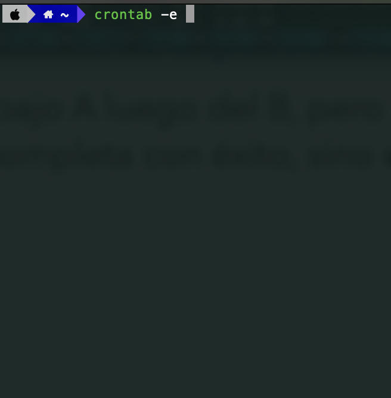
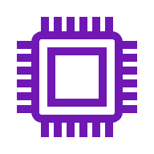
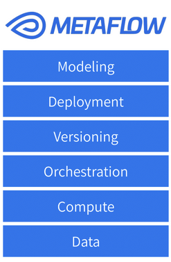

## Diapositiva 1: Orquestadores y sincronizadores

* Operaciones de Aprendizaje Automático I - CEIA - FIUBA

Dr. Ing. Facundo Adrián Lucianna

---

## Diapositiva 2: Administración de recursos

Operaciones de Aprendizaje Automático I - CESE - FIUBA

---

## Diapositiva 3: Administración de recursos

* En el mundo actual que nos manejamos gran parte en la nube, al administrar recursos el enfoque se encuentra en manera rentable.

* Agregar más recursos a un sistema no significa disminuir los recursos para otras aplicaciones, lo que simplifica significativamente el desafío de la asignación.

* Muchas empresas están de acuerdo con agregar más recursos a una aplicación siempre que el costo adicional esté justificado por el retorno.

---

## Diapositiva 4: Administración de recursos

* El tiempo de ingenieros es más valioso que el tiempo de computación, por lo que se tiende a invertir para que sean productivos.

* Esto significa que podría tener sentido que las empresas inviertan en automatizar sus cargas de trabajo, lo que podría hacer que el uso de recursos sea menos eficiente que la planificación manual de sus cargas de trabajo, pero libera a sus ingenieros para que se concentren en el trabajo con mayores retornos.

* A menudo, si un problema se puede resolver utilizando más recursos no humanos o usando más recursos humanos, se tiende a preferir la primera solución.

---

## Diapositiva 5: Orquestadores y sincronizadores

Operaciones de Aprendizaje Automático I - CESE - FIUBA

---

## Diapositiva 6: Orquestadores y sincronizadores

* Hay dos características clave de los flujos de trabajo de ML que influyen en su gestión de recursos: **repetitividad** y **dependencias**.

* El proceso de ML son procesos repetitivos. Por ejemplo,

* Se puede entrenar un modelo cada semana

* Generar un nuevo lote de predicciones cada cuatro horas.

* Estos procesos se pueden programar y orquestar para que se ejecuten de forma rentable utilizando los recursos disponibles.

---

## Diapositiva 7: Orquestadores y sincronizadores

* Si queremos programar trabajos repetitivos para que se ejecuten en horarios fijos, lo podemos realizar usando **cron**.

* Además, podemos ejecutar un script en un momento predeterminado y que nos informe si el trabajo tiene éxito o falla.

* Ahora, cron no tiene en cuenta las **dependencias** entre trabajos.

* Podemos ejecutar el trabajo A luego del B, pero no podemos sincronizar nada complicado, como ejecuta B si A se completa con éxito, sino ejecuta a C.

**Repetitividad**

---

## Diapositiva 8: Orquestadores y sincronizadores

* El flujo de trabajo de Machine Learning tiene dependencias complejas entre tareas, por ejemplo,

* Trae datos de la semana pasada del Data Warehouse

* Extrae lo features de los datos extraídos.

* Entrena dos modelos A y B, con los features

* Compara los dos modelos con un set de testeo

* despliega A si A es mejor, sino despliega B

**Dependencias**

Trae datos del Data Warehouse

Features

Entrena modelo A

Entrena modelo B

Comparación

Despligue de modelo X

---

## Diapositiva 9: Orquestadores y sincronizadores

* Esta forma de representar el flujo de trabajo es lo que llamamos un DAG (directedacyclicgraph).

* No puede contener ciclos, porque podría entrar en bucles infinitos.

* Los DAG es una forma de representar flujos de trabajos, y la mayoría de las herramientas de gestión los utilizan.

**Dependencias**

Trae datos del Data Warehouse

Features

Entrena modelo A

Entrena modelo B

Comparación

Despligue de modelo X

---

## Diapositiva 10: Orquestadores y sincronizadores

* Gestionan dependencias: Programan tareas siguiendo un flujo de trabajo complejo (DAG), no solo por tiempo.

* Activación por eventos: Inician trabajos en respuesta a eventos específicos (ej: un archivo nuevo).

* Manejo de errores avanzado: Permiten reintentar tareas fallidas un número configurable de veces.

* Sistema de colas con prioridades: Organizan y priorizan la ejecución de trabajos.

* Optimización de recursos: Estiman recursos del sistema de forma eficiente para cada tarea.

**Sincronizadores**

---

## Diapositiva 11: Orquestadores y sincronizadores

* Si lo sincronizadores se encargan del cuándo, los orquestadores se encargan del dónde.

* Los orquestadores se ocupan de abstracciones de infraestructura como máquinas, instancias, clústeres, agrupaciones de nivel de servicio, replicación, etc. Si el orquestador nota que hay más trabajos que la cantidad de instancias disponibles, puede aumentar la cantidad de instancias.

* Sincronizadores se usan para trabajos periódicos, mientras que los orquestradores se usan para servicio que tienen un servidor corriendo durante largo tiempo y que responde a solicitudes.

**Oquestadores**

---

## Diapositiva 12: Orquestadores y sincronizadores

* Algunos oquestadores conocidos son:

* Kubernetes

* Openshift

* Docker Swarm

* Docker Compose

* Basados en la nube: GKE, ECS, EKS, AKS,Fargate

**Orquestadores**

---

## Diapositiva 13: Orquestadores y sincronizadores

* Muchas veces se usan términos intercambiablemente entre ambos. Esto se debe a que los sincronizadores tienden a correr encima de oquestadores.

* Los orquestadores específicos de ciencia de datos tienen sus propios sincronizadores como

* Airflow

* Argo

* Prefect

* Dagster

**Orquestadores**vs**Sincronizadores**

---

## Diapositiva 14: Gestión del flujo de trabajo de ciencia de datos

Operaciones de Aprendizaje Automático I - CESE - FIUBA

---

## Diapositiva 15: Gestión de flujo de trabajo

* En su forma más simple, las herramientas de gestión de flujos de trabajo gestionan los flujos de trabajo 🙃

* Casi todas las herramientas de gestión del flujo de trabajo vienen con sincronizadores, por lo que se consideran sincronizadores que, en lugar de centrarse en trabajos individuales, se centran en el flujo de trabajo en su conjunto.

* Una vez que se define un flujo de trabajo, el sincronizadores subyacente generalmente trabaja con un orquestadores para asignar recursos para ejecutar el flujo de trabajo.

Definición

Sincronizador

Orquestadores

Ejecutar tareas

Instancias

---

## Diapositiva 16: Gestión de flujo de trabajo

* Como todo en stack de tecnología de Data Science, está lleno de soluciones, actualmente las más populares son,

* Airflow

* Argo

* Prefect

* Kubeflow

* Metaflow

---

## Diapositiva 17: Gestión de flujo de trabajo

* Los flujos de trabajos de Prefect son parametrizados y dinámicos, es decir que puede crear nuevos pasos cuando se está ejecutando.

* Sigue el principio de configuración como código y estos son definidos en Python.

* Permite correr cada tarea en contenedores, pero no es su principal prioridad.

**Prefect**

---

## Diapositiva 18: Gestión de flujo de trabajo

* En Argo, cada paso corre en su propio contenedor. Es parte esencial de su diseño.

* Los flujos de trabajos se definen en YAML, lo cual permite definir no solo cada paso, sino además los requerimientos.

* El principal punto débil es además de usar YAML (que tiende a ser verboso y desordenado), es que solo funciona en cluster K8s (Kubernetes). Hacer pruebas de local es mucho más difícil ya que tenemos que lidiar con levantar simular el cluster.

**Argo**

---

## Diapositiva 19: Gestión de flujo de trabajo

* Esta herramienta permite ejecutar flujos de trabajos tanto en desarrollo como en producción, abstrayendo el código básico y genérico que generalmente se necesita para ejecutar Aiflow o Argo.

* Brinda a los científicos de datos acceso a toda la potencia informática del entorno de producción desde sus PCs, lo que efectivamente permite utilizar el mismo código tanto en entornos de desarrollo como de producción.

* Para funcionar usa Kubeflow Pipelines que se construye encima de Argo.

* Las tareas se totalmente parametrizadas y dinámicas.

* Para especificar un flujo de trabajo se necesita:

* Un Dockerfile para configurar las imágenes

* Un archivo YAML para las especificaciones de cada paso

* Un script de Python que integre lo anterior para forma el flujo de trabajo.

**Kubeflow**

---

## Diapositiva 20: Gestión de flujo de trabajo

* Es similar a Kubeflow, nada más que su orquestador puede ser K8s o AWS Batch.

* Una diferencia es que todo puede ser definido en un script de Python, haciendo uso de decoradores y automáticamente crea los archivos Dockerfile y YAML.

* Es sumamente pasar indoloramente de desarrollo a producción desde un notebook con un simple cambio del decorador.

**Metaflow**

---

## Diapositiva 21: Apache Airflow

Operaciones de Aprendizaje Automático I - CESE - FIUBA

---

## Diapositiva 22: Apache Airflow

* Airflow es una plataforma open-source que nos permite programar nuestros propios pipelines, definir un periodo de ejecución y monitorearlos.

* Dentro de los beneficios de utilizar Airflow podemos mencionar:

* Para programar los pipelines se utiliza Python.

* Es muy escalable, podemos ejecutar tantas tareas como queramos (lo que permita nuestro poder de cómputo).

* Brinda una interfaz de usuario muy amigable.

* Se pueden incorporar plug-ins creados por el usuario de manera muy sencilla.

* Desventajas frente a las soluciones que vimos es:

* Los flujos de trabajo son estáticos, no puede crear nuevos pasos automáticamente mientras se ejecuta.

* Los flujos de trabajo son no parametrizables, es decir si entrenamos un modelo con diferentes parámetros, debemos definir un flujo independiente para cada uno.

* Es monolítica, donde un flujo de trabajo corre en un contenedor, salvo al usar a DockerOperator

---

## Diapositiva 23: Apache Airflow

**Componentes principales**

Web server

Scheduler

Metastore

Triggerer

Executor

Queue

Worker

---

## Diapositiva 24: Apache Airflow

**Operador**

* El operator es una tarea dentro de Airflow, una manera de encapsular código.

* Existen tres tipos de operadores:

* **Action****Operators****:**Ejecutan alguna tarea, como por ejemplo existen Python operators, Bashoperators, etc.

* **Transfer****Operators****:**Permiten transferir información de un punto a otro. Por ejemplo, de una base de datos MySQL a RedShift

* **Sensor****Operators****:**Este tipo de operadores nos permiten esperar a que suceda algún evento para avanzar a la siguiente tarea.

---

## Diapositiva 25: Apache Airflow

**Qué no es****Airflow**

Streaming

Procesamiento de datos

---

## Diapositiva 26: Apache Airflow

**Arquitectura**

Web server

Scheduler

Metastore

Executor

Queue

**Nodo**

---

## Diapositiva 27: Apache Airflow

**Arquitectura**

Web server

Scheduler

Metastore

Executor

Queue

**Nodo 1**

**Nodo 2**

**Worker****Node**

AirflowWorker

**Worker****Node**

AirflowWorker

**Worker****Node**

AirflowWorker

---

## Diapositiva 28: Apache Airflow

**Funcionamiento de****Airflow**

Web server

Scheduler

Metastore

Executor

Queue

**Nodo**

📂 DAGS

Nuevo DAG

TaskInstance

TaskInstance

DagRun

---

## Diapositiva 29: Apache Airflow

* Realicemos un Hands-on de Apache Airflow…