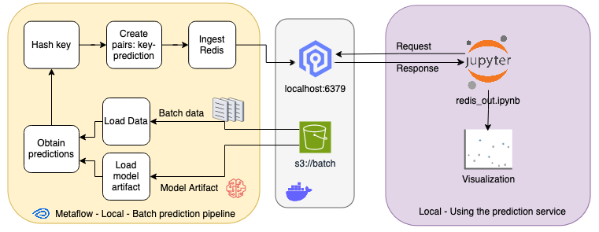

# Hands-on - Batch Processing



En este hands-on, vamos a desarrollar un ejemplo de un procesamiento de Batch Processing. Para ello usamos los datos 
de [Iris Dataset](https://scikit-learn.org/stable/auto_examples/datasets/plot_iris_dataset.html), y un modelo de [XGBoost](https://xgboost.readthedocs.io/en/stable/) que ya fue entrenado. Una vez que se obtienen las predicciones, 
se ingestan en una base de datos de Redis, ya que queremos tener una respuesta de baja de latencia para saber la salida
de los datos. El ejemplo no es el mejor, dado el tipo de entradas, pero esta base de datos es óptima para cuando 
tenemos datos de usuarios y podemos identificar a los mismos, de tal forma uqe podemos guardar los datos con un user id
y la salida del modelo, entre otros ejemplos.

La implementación cuenta con una parte que funciona de forma local y otra en Docker Compose:

## Docker Compose

Para este ejemplo se levantan dos servicios:

- [MinIO](https://min.io/): Con este servicio simulamos el uso de un Bucket S3 de Amazon. Para este ejemplo se crea un
bucket llamado `batch` con los datos que se quieren predecir y el artefacto del modelo. 
- [Redis](https://redis.io/): Redis es un motor de base de datos en memoria, basado en el almacenamiento en tablas de 
hashes.

Para que levantar los servicios, desde la raíz de este repo hacer:

```bash
docker compose up
```

## Ejecución Local

Para la ejecución local se cuenta con:

- Un DAG de Metaflow. Este DAG está diseñado para realizar predicciones en lotes utilizando un modelo previamente 
entrenado. El DAG llamado `batch_processing.py` se encuentra en `metaflow`.
- Una notebook para testar a Redis. El notebook establece una conexión con el servidor Redis utilizando la biblioteca 
de Python para Redis. Luego, se recupera las predicciones almacenadas en Redis para los datos de entrada utilizando 
las claves generadas anteriormente.

Nota: Para que funcione tanto el DAG como la notebook, los servicios de Docker deben estar levantados.

El DAG consta de varios pasos:

- `start`: Este paso inicia el flujo e imprime un mensaje de inicio. Luego, avanza para cargar los datos y el modelo.
- `load_data`: Carga los datos de entrada desde un bucket S3 utilizando la biblioteca Metaflow y los almacena en un 
DataFrame de pandas.
- `load_model`: Carga el modelo previamente entrenado desde un bucket S3 utilizando la biblioteca Metaflow y lo carga 
en un objeto XGBClassifier.
- `batch_processing`: Utiliza el modelo cargado para realizar predicciones en lotes en los datos cargados. Genera un 
hash para cada fila de datos y almacena las predicciones en un diccionario.
- `ingest_redis`: Ingresa las predicciones en Redis utilizando la biblioteca de Python para Redis. Establece una 
conexión con el servidor Redis a través de la biblioteca y almacena las predicciones en Redis.
- `end`: Imprime un mensaje de finalización del flujo.

Esto fue armado usado Python 3.11, pero no debería haber problemas con versiones de Python >3.8. Los requerimientos
se encuentran en `requirements.txt`. 

Para ejecutar el flujo de trabajo de Metaflow hacer

```bash
python3 ./metaflow/batch_processing.py run
```

### Apagar los servicios

Estos servicios ocupan cierta cantidad de memoria RAM y procesamiento, por lo que cuando no se están utilizando, se 
recomienda detenerlos. Para hacerlo, ejecuta el siguiente comando:

```bash
docker compose down
```

Si deseas no solo detenerlos, sino también eliminar toda la infraestructura (liberando espacio en disco), 
utiliza el siguiente comando (usarlo con responsabilidad):

```bash
docker compose down --rmi all --volumes
```

Nota: Si haces esto, perderás todo en los buckets y bases de datos.
