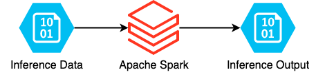
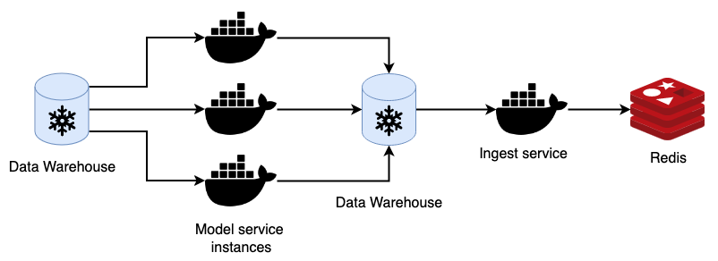
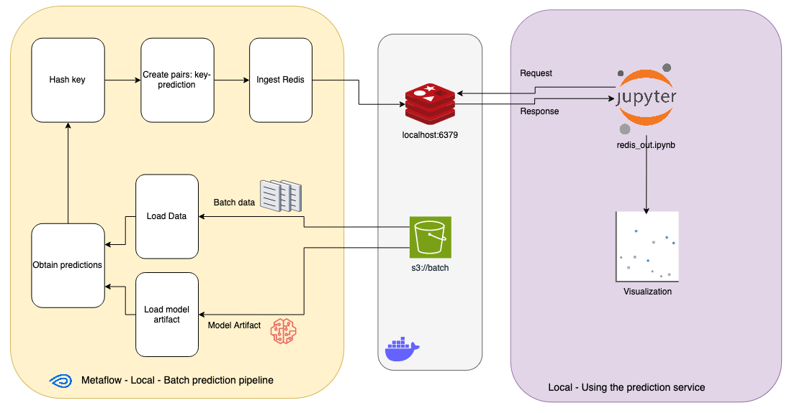

## Diapositiva 1: Desplegado de modelos. Predicción en lotes

* Operaciones de Aprendizaje Automático I - CEIA - FIUBA

Dr. Ing. Facundo Adrián Lucianna

---

## Diapositiva 2: Repaso de la clase anterior

Operaciones de Aprendizaje Automático I - CESE - FIUBA

---

## Diapositiva 3: Oquestadores y sincronizadores

* Hay dos características clave de los flujos de trabajo de ML que influyen en su gestión de recursos: **repetitividad** y **dependencias**.

* El proceso de ML son procesos repetitivos. Por ejemplo,

* Se puede entrenar un modelo cada semana

* Generar un nuevo lote de predicciones cada cuatro horas.

* Estos procesos se pueden programar y orquestar para que se ejecuten de forma rentable utilizando los recursos disponibles.

---

## Diapositiva 4: Oquestadores y sincronizadores

* Toman el DAG de un flujo de trabajo y programa cada paso. Inclusive puede puede programar el inicio de un trabajo en función de un activador basado en eventos, por ejemplo, iniciar un trabajo cada vez que ocurra un evento X.

* También permiten especificar acciones si un trabajo falla o termina con éxito, teniendo ajustes finos como re-intentar varias N veces antes de dar por vencido.

* Una tarea que también realizan es optimizar la utilización de recursos, ya que tienen información sobre los recursos disponibles, los trabajos a ejecutar y los recursos necesarios para ejecutar cada trabajo.

**Sincronizadores**

---

## Diapositiva 5: Oquestadores y sincronizadores

* Si lo sincronizadores se encargan del cuándo, los orquestadores se encargan del dónde.

* Los orquestadores se ocupan de abstracciones de infraestructura como máquinas, instancias, clústeres, agrupaciones de nivel de servicio, replicación, etc. Si el orquestador nota que hay más trabajos que la cantidad de instancias disponibles, puede aumentar la cantidad de instancias.

* Sincronizadores se usan para trabajos periódicos, mientras que los orquestradores se usan para servicio que tienen un servidor corriendo durante largo tiempo y que responde a solicitudes.

**Oquestadores**

---

## Diapositiva 6: Gestión de flujo de trabajo

* En su forma más simple, las herramientas de gestión de flujos de trabajo gestionan los flujos de trabajo 🙃

* Casi todas las herramientas de gestión del flujo de trabajo vienen con sincronizadores, por lo que se consideran sincronizadores que, en lugar de centrarse en trabajos individuales, se centran en el flujo de trabajo en su conjunto.

* Una vez que se define un flujo de trabajo, el sincronizadores subyacente generalmente trabaja con un oquestadores para asignar recursos para ejecutar el flujo de trabajo.

Definición

Sincronizador

Oquestadores

Ejecutar tareas

Instancias

---

## Diapositiva 7: Apache Airflow

* Airflow es una plataforma open-source que nos permite programar nuestros propios pipelines, definir un periodo de ejecución y monitorearlos.

* Dentro de los beneficios de utilizar Airflow podemos mencionar:

* Para programar los pipelines se utiliza Python.

* Es muy escalable, podemos ejecutar tantas tareas como queramos (lo que permita nuestro poder de cómputo).

* Brinda una interfaz de usuario muy amigable.

* Se pueden incorporar plug-ins creados por el usuario de manera muy sencilla.

---

## Diapositiva 8: Despliegue de modelos

Operaciones de Aprendizaje Automático I - CESE - FIUBA

---

## Diapositiva 9: Ciclo de vida de un proyecto de Aprendizaje Automático

Problema de negocio

Definición de objetivos

Recolección de datos y preparación

Featureengineering

Evaluación del modelo

Despliegue del modelo

Servicio del modelo

Monitoreo del modelo

Mantenimiento del modelo

Entrenamiento del modelo

En clase 2 y AMq1

En clase 3 y 4, AMq1 y AdD

En clase 3

---

## Diapositiva 10: Despliegue de modelos

* Una vez que armamos nuestros modelos, estructuramos…, está listo para ser desplegado.

* Desplegar un modelo significa dejarlo disponible para que acepte consultas de los usuarios en producción.

* Una vez que el sistema de producción acepta la consulta, esta última se transforma en un vector de características. El vector de características se envía luego al modelo como entrada para que prediga una salida. El resultado luego se devuelve al usuario.

Consulta

Resultado

---

## Diapositiva 11: Despliegue de modelos

* Un modelo puede ser implementado siguiendo varios patrones:

* Estáticamente, como parte de un paquete de software instalable.

* Dinámicamente en el dispositivo del usuario.

* Dinámicamente en un servidor.

* Mediante transmisión de modelo

---

## Diapositiva 12: Despliegue de modelos

* El despliegue de un modelo de aprendizaje automático es muy similar al despliegue de software tradicional. El modelo se empaqueta como un recurso disponible en tiempo de ejecución.

**Estáticamente**

---

## Diapositiva 13: Despliegue de modelos

* Similar al anterior, pero ahora el modelo no es parte del binario de ejecución. Permite más fácil hacer mejoras o cambios de modelos, sin cambiar toda la aplicación. Se puede hacer asignación dinámica de un modelo en particular, dado recursos del dispositivo.

* Este despliegue se puede hacer en varias formas:

* **Despliegue de parámetros del modelo:**El archivo del modelo solo contiene los parámetros aprendidos, mientras que el dispositivo tiene instalado el runtime.

* **Despliegue de objetos serializados**: El modelo se envía serializado junto a sus dependencias, para que una vez de-serializado, se puede usar sin dependencias.

* **Desplegando en el browser:**Es posible desplegar un modelo usando el runtime de Javascript del browser.

**Dinámicamente en el dispositivo del usuario**

---

## Diapositiva 14: Despliegue de modelos

* Dada las complicaciones de desplegar en el dispositivo del usuario, la forma más frecuente es el despliegue en el servidor, y hay dos formas básicas que podemos hacer esto:

* **Despliegue on-line:**El cliente envía una solicitud al servidor y luego espera una respuesta. La forma más básica de esto es mediante una REST API.

* **Despliegue para funcionar en lote:**La predicción por lotes ocurre cuando las predicciones se generan periódicamente o cuando se activan. En estos casos el modelo no tiene que estar activo todo el tiempo.

**Dinámicamente en servidor**

---

## Diapositiva 15: Despliegue de modelos

* Este es un patrón de implementación que puede considerarse como inverso al de REST API.

* En REST API, el cliente envía una solicitud al servidor y luego espera una respuesta. En sistemas complejos, puede haber muchos modelos aplicados al mismo conjunto de datos de entrada o un modelo puede recibir una predicción de otro modelo.

* El modelado de transmisión funciona de manera diferente. En lugar de tener una REST API por modelo, todos los modelos, así como el código necesario para ejecutarlos, están registrados dentro de un motor de procesamiento de transmisiones. Ejemplos son Apache Storm, Apache Spark y Apache Flink.

**Transmisión de modelo**

---

## Diapositiva 16: Despliegue de modelos

* Los datos de entrada fluyen como una corriente infinita de elementos de datos enviados por el cliente. Siguiendo una topología predefinida, cada elemento de datos en la corriente experimenta una transformación en los nodos de la topología. Transformado, el flujo continúa hacia otros nodos.

**Transmisión de modelo**

Modelo 1

Modelo 2

Modelo 3

Modelo 4

Cliente

Request

Response

Request

Response

Request

Response

Request

Response

**REST API**

Cliente

Abre conexión

Request

Event

**Streaming**

Cierra conexión

Event

Event

Event

---

## Diapositiva 17: Estrategias de despliegue

Operaciones de Aprendizaje Automático I - CESE - FIUBA

---

## Diapositiva 18: Estrategia de despliegue

* Supongamos que tenemos no solo el modelo, sino, además, la forma de despliegue, pero ahora nos falta ver la estrategia de despliegue. Tenemos al menos estas técnicas:

* **Despliegue único**

* **Despliegue silencioso**

* **A/B****testing**

* **Canary****Release**

* **Bandidos**

---

## Diapositiva 19: Estrategia de despliegue

* Esta es la forma más fácil de implementar, la más usada, pero quizás la peor.

* Una vez que hay un nuevo modelo, se reemplaza el anterior con el nuevo, y todo el pipeline asociado.

* Es la peor, dado que, si el modelo tiene bugs, o no rinde como debería, se envió en producción algo que nos va a dar un gran dolor de cabeza depurar.

* En general, la primera vez que se despliega el primer modelo, se hace así, aunque es recomendable, tal como vimos en las 4 fases del desarrollo de modelos (clase 2), tener previamente una heurística con que comparar y hacer un despliegue en los formatos que veremos a continuación.

**Despliegue único**

---

## Diapositiva 20: Estrategia de despliegue

* Esta versión despliega la nueva versión del modelo, manteniendo el antiguo modelo. Ambas versiones se ejecutan en paralelo. Sin embargo, el usuario no estará expuesto a la nueva versión hasta que se complete el cambio. Las predicciones realizadas por la nueva versión solo se registran. Después de algún tiempo, se analizan para detectar posibles errores.

* El despliegue silencioso tiene la ventaja de proporcionar suficiente tiempo para asegurarse de que el nuevo modelo funcione según lo esperado, sin afectar negativamente a ningún usuario.

* El inconveniente es la necesidad de ejecutar el doble de modelos, lo que consume más recursos.

**Despliegue silencioso**

---

## Diapositiva 21: Estrategia de despliegue

* La prueba A/B es una forma de comparar dos variantes del modelo, y determinando cuál de las dos variantes es más efectiva.

* La prueba A/B funciona de la siguiente manera:

* Se despliega el modelo candidato junto al modelo existente.

* Un porcentaje del tráfico se dirige al nuevo modelo; el resto se dirige al modelo existente. Es común que ambas variantes sirvan tráfico de predicciones al mismo tiempo.

* Se monitorea y analiza las predicciones y los comentarios de los usuarios, si los hay, de ambos modelos para determinar si la diferencia en el rendimiento de los dos modelos es estadísticamente significativa.

* Para que esto funcione debemos tomar ciertos recaudos. Como lograr que el tráfico sea realmente aleatorio y representativo.

* Libro especifico de esto: Kohavi et al - Trustworthy Online ControlledExperiments: A Practical Guide to A/B Testing

**A/B****Testing**

---

## Diapositiva 22: Estrategia de despliegue

* Es una técnica para reducir el riesgo de introducir un nuevo modelo en producción al implementar el cambio gradualmente en un pequeño subconjunto de usuarios antes de implementarlo en toda la infraestructura y hacerlo disponible para todos. La forma que se hace es:

* Se despliega el modelo candidato junto al modelo existente. El modelo candidato se llama canary.

* Una porción del tráfico se dirige al modelo candidato.

* Si su rendimiento es satisfactorio, aumenta el tráfico hacia el modelo candidato. Si no, aborta el canary y dirige todo el tráfico de vuelta al modelo existente.

* Se detiene el proceso cuando el canary haya servido todo el o cuando se aborta.

* Canaryreleasepuede ser utilizado para implementar A/B testing debido a las similitudes en sus configuraciones. Sin embargo, se puede realizarlo sin aplicar A/B testing. Por ejemplo, no es necesario aleatorizar el tráfico para dirigirlo a cada modelo.

**Canary****Release**

---

## Diapositiva 23: Estrategia de despliegue

* Los algoritmos de bandidos son herramientas que se utilizan para la toma de decisiones secuenciales bajo incertidumbre. Tienen su origen en el ámbito de los juegos de azar, como las máquinas tragamonedas de un casino. La idea principal es equilibrar la exploración de nuevas opciones con la explotación de opciones conocidas, con el objetivo de maximizar una recompensa acumulada a lo largo del tiempo.

* Cuando se tiene múltiples modelos para evaluar, cada modelo puede considerarse una máquina tragamonedas cuya precisión de la predicción no se conoce. Aplicar esto algoritmos,  permiten determinar cómo dirigir el tráfico a cada modelo para la predicción y así determinar el mejor modelo mientras se maximiza la precisión de la predicción.

* Un punto importante es que, para aplicar estos algoritmos, antes de dirigir una solicitud a un modelo, se necesita calcular el rendimiento actual de todos los modelos. Esto requiere tres cosas:

* Solo aplicable a modelos on-line.

* Preferiblemente la retroalimentación debe ser rápida.

* Un mecanismo para tomar las retroalimentaciones.

**Bandidos**

---

## Diapositiva 24: Sirviendo modelos

Operaciones de Aprendizaje Automático I - CESE - FIUBA

---

## Diapositiva 25: Sirviendo modelos

* Ya está, tenemos pipeline, tenemos modelo definido, desarrollado y desplegado, ahora queremos llevarlo a producción, para ello creamos el servicio del modelo, que la forma que tendrá dependerá de cómo desplegamos el modelo (REST API, predicción en lote, en dispositivo de usuario, etc.).

---

## Diapositiva 26: Propiedades del entorno de ejecución de un modelo

Operaciones de Aprendizaje Automático I - CESE - FIUBA

---

## Diapositiva 27: Propiedades del entorno de ejecución de un modelo

* El entorno de ejecución del servicio del modelo es el ambiente en el que el modelo se aplica a los datos de entrada. Las propiedades del entorno de ejecución están dictadas por el patrón de implementación del modelo. Un entorno de ejecución efectivo tiene varias propiedades interesantes de mencionar:

* **Seguridad y Corrección:**Un punto importante cuando servimos el modelo, es que debemos implementar autenticaciones que nos permitan identificar al usuario. Cosas para verificar son:

  * Si el usuario especifico tiene acceso autorizado al modelo.

  * Si los nombres y valores de los parámetros que se pasan corresponden a las especificaciones (Típico punto de ataque).

  * Si esos parámetros y sus valores están actualmente disponibles para el usuario.

---

## Diapositiva 28: Propiedades del entorno de ejecución de un modelo

* El entorno de ejecución del servicio del modelo es el ambiente en el que el modelo se aplica a los datos de entrada. Las propiedades del entorno de ejecución están dictadas por el patrón de implementación del modelo. Un entorno de ejecución efectivo tiene varias propiedades interesantes de mencionar:

* **Facilidad de Implementación:**El entorno de ejecución debe permitir que el modelo se actualice con un esfuerzo mínimo y, idealmente, sin afectar toda la aplicación.

* Por ejemplo, si el modelo se desplegó como un contenedor, entonces los contenedores que ejecuten la versión anterior del modelo deben ser reemplazables deteniendo gradualmente las instancias en ejecución y comenzando nuevas instancias desde una nueva imagen. El mismo principio se aplica a los contenedores orquestados.

---

## Diapositiva 29: Propiedades del entorno de ejecución de un modelo

* El entorno de ejecución del servicio del modelo es el ambiente en el que el modelo se aplica a los datos de entrada. Las propiedades del entorno de ejecución están dictadas por el patrón de implementación del modelo. Un entorno de ejecución efectivo tiene varias propiedades interesantes de mencionar:

* **Garantía de validez del modelo:**Un entorno de ejecución efectivo se asegurará automáticamente de que el modelo que ejecuta sea válido. Además, se asegura de que el modelo, el pipeline y otros componentes estén sincronizados. Debe validarse en cada inicio del servicio web o de la aplicación de transmisión, y periódicamente durante la ejecución.

* El modelo no debe servirse en producción si nos encontramos con:

  * Si el testeo de punta a punta del flujo de trabajo falla

  * Si los valores de métricas de evaluación, calculado con un conjunto de pruebas de confianza, no está dentro del rango aceptable.

---

## Diapositiva 30: Propiedades del entorno de ejecución de un modelo

* El entorno de ejecución del servicio del modelo es el ambiente en el que el modelo se aplica a los datos de entrada. Las propiedades del entorno de ejecución están dictadas por el patrón de implementación del modelo. Un entorno de ejecución efectivo tiene varias propiedades interesantes de mencionar:

* **Facilidad de recuperación:**Un entorno de ejecución efectivo permite una fácil recuperación de errores al retroceder a versiones anteriores.

* La recuperación de un despliegue fallido debe realizarse de la misma manera y con la misma facilidad que el despliegue de un modelo actualizado. La única diferencia es que, en lugar del nuevo modelo, se desplegará la versión previa que funcionaba.

---

## Diapositiva 31: Propiedades del entorno de ejecución de un modelo

* El entorno de ejecución del servicio del modelo es el ambiente en el que el modelo se aplica a los datos de entrada. Las propiedades del entorno de ejecución están dictadas por el patrón de implementación del modelo. Un entorno de ejecución efectivo tiene varias propiedades interesantes de mencionar:

* **Evitar diferencias de código en entrenamiento y servicio:**Se recomienda evitar el uso de dos bases de código diferentes, una para entrenar el modelo y otra para puntuar en producción. Ya vimos esto cuando hablamos del cálculo de features.

* Esto es más difícil de hacer que de decirlo, pero arrancar desde el comienzo con esto. Por eso en la clase 1 empezamos con buenas prácticas de programación como mínimo para facilitar esto.

---

## Diapositiva 32: Propiedades del entorno de ejecución de un modelo

* El entorno de ejecución del servicio del modelo es el ambiente en el que el modelo se aplica a los datos de entrada. Las propiedades del entorno de ejecución están dictadas por el patrón de implementación del modelo. Un entorno de ejecución efectivo tiene varias propiedades interesantes de mencionar:

* **Evitar bucles de retroalimentación ocultos:** Un modelo puede afectar indirectamente los datos utilizados para entrenar otro modelo.

* Si un modelo de detección de SPAM, además incorporamos en la aplicación la posibilidad al usuario de hacer lo mismo. Esto lo queremos para mejorar el modelo, pero tenemos el riesgo de crear un bucle de retroalimentación oculto que nos afecte.

* Esto es porque el usuario va a marcar mensajes de SPAM cuando los ve, sin embargo, solo los ve cuando el modelo lo clasifico como NO SPAM. Además, es difícil que el usuario baja a la sección de SPAM a ver si no son SPAM. Por lo tanto, el efecto es fuertemente afectado por el modelo, lo que incorpora sesgo en los datos.

* La forma en que se evita esto, es cada tanto pasar un pequeño porcentaje de mails directo al usuario sin que lo vea el modelo.

---

## Diapositiva 33: Predicción en lotes

Operaciones de Aprendizaje Automático I - CESE - FIUBA

---

## Diapositiva 34: Predicción en lotes

* Un modelo generalmente se sirve en modo por lotes cuando se aplica a **grandes cantidades de datos de entrada**. Las predicciones se almacenan en algún lugar, como en tablas SQL o en una base de datos en memoria, y se recuperan según sea necesario.

* Un ejemplo podría ser cuando el modelo se utiliza para procesar exhaustivamente los datos de todos los usuarios de un producto o servicio. O cuando se aplica sistemáticamente a todos los eventos entrantes, como tweets o comentarios en publicaciones en línea.

* En este modo el modelo generalmente acepta entre cien y mil entradas a la vez, y se puede escalar horizontalmente para lograr más predicciones.

ModelService

App

Data warehouse

BBDD

Request

Precomputed

prediction

Batchfeatures

Predictions

---

## Diapositiva 35: Predicción en lotes

---

## Diapositiva 36: Predicción en lotes

* Algunos casos de uso a mencionar son:

* Generar la lista de recomendaciones semanales de nuevas canciones para todos los usuarios de un servicio de transmisión de música.

* Clasificar el flujo de comentarios entrantes a artículos de noticias en línea y publicaciones de blogs como SPAM o NO SPAM.

* Extraer entidades nombradas de documentos indexados por un motor de búsqueda.

---

## Diapositiva 37: Predicción en lotes

* Ejemplos,

---

## Diapositiva 38: Predicción en lotes

* Ejemplos,

---

## Diapositiva 39: Predicción en lotes – ejemplo de aplicación

Operaciones de Aprendizaje Automático I - CESE - FIUBA

---

## Diapositiva 40: Predicción en lotes - ejemplo

* Veamos un ejemplo en concreto, que lo tenemos en el repositorio de ejemplos

---

## Diapositiva 41: Predicción en lotes - ejemplo

* En este caso, tenemos un artefacto de inferencia de XGBoost, y el conjunto de datos que queremos obtener su predicción, todos en un bucket de S3 (MinIO). Este modelo fue entrenado con el dataset de iris.

* Aprovechando la capacidad de Metaflow de darnos un orquestador y un registro de modelos, armamos un DAG, el cual el mismo se ejecuta de local (podríamos usar este DAG en la nube si siguiéramos la documentación de Metaflow). El DAG que armamos tiene la siguiente forma…

Load Data

Start

Load Model

Batchprocessing

Ingest Redis

End

---

## Diapositiva 42: Predicción en lotes - ejemplo

* Como fin del DAG, tenemos un proceso que ingesta los datos que el modelo acaba de predecir. Estos datos los estamos agregando en una base de datos Redis.

* Redis es un motor de base de datos en memoria, basado en el almacenamiento en tablas de hashes. Redis es muy útil cuando necesitamos baja latencia, hasta podríamos usarlo como cache en un caso de predicción on-line para soportar aquellos inputs que sabemos que son comunes, y solo dejar al modelo para predicciones menos frecuentes, de tal forma que podamos responder en milisegundos.

* El gran inconveniente de Redis es que un cluster de Redis exige maquinas con mucha memoria RAM, y por consiguiente más cara que otras soluciones.

* Tranquilamente para este ejemplo podríamos haber usado otra base de datos NoSQL de key-value como Apache Cassandra, o una base de datos SQL tradicional, o guardar como archivos CSV, parquet, json y de ahí a la nube o de modo local.

---

## Diapositiva 43: Predicción en lotes - ejemplo

---

## Diapositiva 44: Predicción en lotes - ejemplo

* * No es una buena idea convertir a floats en cadena de caracteres, dado la precisión. En este caso, nos salimos con la nuestra porque:

* Redondeamos a un decimal

* Python cuando convierte de float a string, no pone la cantidad de ceros que siguen, sino que deja fijo siempre en tres caracteres (la parte entera, el punto y el primer decimal).

* Pero si pensamos que esto podría en el mañana implementarse usando un lenguaje de programación que esto no se respeta, podemos tener problemas.

* La solución a esto para que sea más seguro, y agnóstico de la implementación, se recomienda que:

* Convertir a los floats en enteros usando una forma una representación de punto fijo.

* Guardar los caracteres de la parte entera y el decimal, y armar una cadena de caracteres con eso.

* Una mejor solución, asociar a una entrada con un **id**, esto para este ejemplo es más complicado, pero en otras aplicaciones podrías usar como key un usr_id, product_id, etc, que sea un **id** que asocie a esa entrada en particular. El cual cuando volvamos a recuperar los valores, el sistema consulte usando ese **id**, permitiéndonos inclusive, que la predicción de nuestro modelo para ese **id** cambie a medida que cambia información de la **entidad** que este asociado ese **id**.

---

## Diapositiva 45: Predicción en lotes - ejemplo

* En el notebook **redis_out.iypnb****,** se dejó a modo de ejemplo como se consume las predicciones en lotes.

* En este, nos conectamos con Redis, y le pasamos valores aplicando la misma técnica de hasheo que acabamos de decir. Redis nos devuelve las salidas que el modelo ya predijo.

* ¿Qué pasa si Redis no tiene el valor para una salida en particular?

* Para el caso que se implementó, lo que hacemos es por defecto definirle que, ante un valor desconocido, se devuelva que es ‘setosa’.

* Pero, se pueden hacer múltiples cosas antes ese caso, entre ellos podemos mencionar:

* Podríamos tener un servicio on-line de nuestro modelo funcionando (o inclusive apagado y levantarlo para esos casos i.e. AWS Lambda), y si Redis no tiene la entrada, pasamos esa entrada al modelo. Con esta salida…

  * Se la presentamos al usuario

  * La ingestamos en Redis para que nuevas consultas, ya tenga la respuesta (funcionamiento como cache).

* Si no tenemos el servicio on-line, dar una salida de alguna forma (i.e. vecinos cercanos) o indicar la falta. Además, se guarda esta entrada para que sea procesada en siguientes ejecuciones de la predicción en lote.

---

## Diapositiva 46: Predicción en lotes - ejemplo

* Intentemos recrear el ejemplo mediante un Hands-on…