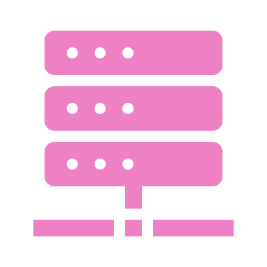
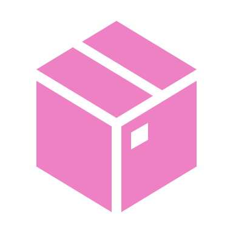

## Diapositiva 1: Desplegado de modelos. Predicción on-line

* Operaciones de Aprendizaje Automático I - CEIA - FIUBA

Dr. Ing. Facundo Adrián Lucianna

---

## Diapositiva 2: Repaso de la clase anterior

Operaciones de Aprendizaje Automático I - CESE - FIUBA

---

## Diapositiva 3: Ciclo de vida de un proyecto de Aprendizaje Automático

Problema de negocio

Definición de objetivos

Recolección de datos y preparación

Featureengineering

Evaluación del modelo

Despliegue del modelo

Servicio del modelo

Monitoreo del modelo

Mantenimiento del modelo

Entrenamiento del modelo

En clase 2 y AMq1

En clase 3 y 4, AMq1 y AdD

En clase 3

---

## Diapositiva 4: Despliegue de modelos

* Una vez que armamos nuestros modelos, estructuramos…, está listo para ser desplegado.

* Desplegar un modelo significa dejarlo disponible para que acepte consultas de los usuarios en producción.

* Una vez que el sistema de producción acepta la consulta, esta última se transforma en un vector de características. El vector de características se envía luego al modelo como entrada para que prediga una salida. El resultado luego se devuelve al usuario.

Consulta

Resultado

---

## Diapositiva 5: Despliegue de modelos

* Un modelo puede ser implementado siguiendo varios patrones:

* Estáticamente, como parte de un paquete de software instalable.

* Dinámicamente en el dispositivo del usuario.

* Dinámicamente en un servidor.

* Mediante transmisión de modelo

---

## Diapositiva 6: Estrategia de despliegue

* Supongamos que tenemos no solo el modelo, sino, además, la forma de despliegue, pero ahora nos falta ver la estrategia de despliegue. Tenemos al menos estas técnicas:

* **Despliegue único**

* **Despliegue silencioso**

* **A/B****testing**

* **Canary****Release**

* **Bandidos**

---

## Diapositiva 7: Predicción en lotes

* Un modelo generalmente se sirve en modo por lotes cuando se aplica a **grandes cantidades de datos de entrada**. Las predicciones se almacenan en algún lugar, como en tablas SQL o en una base de datos en memoria, y se recuperan según sea necesario.

* Un ejemplo podría ser cuando el modelo se utiliza para procesar exhaustivamente los datos de todos los usuarios de un producto o servicio. O cuando se aplica sistemáticamente a todos los eventos entrantes, como tweets o comentarios en publicaciones en línea.

* En este modo el modelo generalmente acepta entre cien y mil entradas a la vez, y se puede escalar horizontalmente para lograr más predicciones.

ModelService

App

Data warehouse

BBDD

Request

Precomputed

prediction

Batchfeatures

Predictions

---

## Diapositiva 8: Despliegue de modelos revisitado

Operaciones de Aprendizaje Automático I - CESE - FIUBA

---

## Diapositiva 9: Despliegue de modelos

* La clase pasada vimos diferentes formas que podemos desplegar un modelo. Una que no desarrollamos es:

* **Despliegue on-line:**El cliente envía una solicitud al servidor y luego espera una respuesta. La forma más básica de esto es mediante una REST API.

* Veamos diferentes casos…

---

## Diapositiva 10: Despliegue de modelos

* En una arquitectura de servicio web típica implementada en un entorno de nube, las predicciones se entregan en respuesta a solicitudes HTTP.

* Un servicio web que se ejecuta en una máquina virtual recibe una solicitud de usuario que contiene los datos de entrada, llama al sistema de Aprendizaje Automático con esos datos de entrada y luego transforma la salida del sistema en notación de objetos JavaScript (JSON) o en lenguaje de marcado extensible (XML).

**Desplegado en una máquina virtual**

---

## Diapositiva 11: Despliegue de modelos

* Para hacer frente a un aumento de la demanda, se pueden ejecutar varias máquinas virtuales idénticas en paralelo.

* Un **balanceador de carga**envía las solicitudes entrantes a una máquina virtual específica, según su disponibilidad. Las máquinas virtuales se pueden agregar y cerrar manualmente o parte de un sistema que inicia o finaliza máquinas virtuales según su uso.

**Desplegado en una máquina virtual**

Instancia 1

Instancia 2

Instancia 3

Instancia 4

Instancia 5

---

## Diapositiva 12: Despliegue de modelos

* La **ventaja** de implementar en una máquina virtual es que la arquitectura del sistema de software es conceptualmente simple: es un servicio web típico.

* **Desventajas:**

* Mantener los servidores (físicos o virtuales).

* Existe una sobrecarga computacional adicional debido a la virtualización y la ejecución de múltiples sistemas operativos.

* Latencia de la red.

**Desplegado en una máquina virtual**

Instancia 1

Instancia 2

Instancia 3

Instancia 4

Instancia 5

---

## Diapositiva 13: Despliegue de modelos

* Trabajar con contenedores se considera más flexible y eficiente en el uso de recursos que con máquinas virtuales.

* Recordemos que un contenedor es similar a una máquina virtual, en el sentido de que también es un entorno de ejecución aislado con su propio sistema de archivos, CPU, memoria y espacio de proceso.

* La principal diferencia es que todos los contenedores se ejecutan en la misma máquina virtual o física y comparten el sistema operativo, mientras que cada máquina virtual ejecuta su propia instancia del sistema operativo.

**Desplegado en contenedores**

---

## Diapositiva 14: Despliegue de modelos

* El sistema de aprendizaje automático y el servicio web se instalan dentro de un contenedor.

* Luego se utiliza un sistema de orquestación de contenedores para ejecutar los contenedores en un grupo de servidores físicos o virtuales.

* Similar a la máquina virtuales, se puede quitar o agregar manualmente nuevas máquinas al clúster o de forma automática.

**Desplegado en contenedores**

Contenedor 1

Contenedor 2

Contenedor 3

Contenedor 4

Contenedor 5

---

## Diapositiva 15: Despliegue de modelos

* **Ventajas**:

* Eficiente en cuanto a recursos.

* Permite **escalar a cero**. La idea de escalar a cero es que un contenedor se puede reducir a cero réplicas cuando está inactivo y volver a activarlo si hay una solicitud para servir.

* El consumo de recursos es bajo en comparación con los servicios que siempre están en ejecución. Esto conduce a un menor consumo de energía y ahorra costos de recursos en la nube.

* **Desventaja**:

* La implementación en contenedores se considera más complicada y requiere experiencia.

**Desplegado en contenedores**

Contenedor 1

Contenedor 2

Contenedor 3

Contenedor 4

Contenedor 5

---

## Diapositiva 16: Despliegue de modelos

* Varios proveedores de servicios en la nube ofrecen la llamada informática sin servidor.

* La implementación sin servidor consiste en preparar un archivo zip con todo el código necesario para ejecutar el sistema de aprendizaje automático o una imagen de contenedor.

* La plataforma en la nube proporciona una API para enviar entradas a la función sin servidor. La plataforma en la nube se encarga de implementar el código y el modelo en un recurso computacional adecuado, ejecutar el código y enrutar la salida al cliente.

* Por lo general, el tiempo de ejecución de la función, el tamaño del archivo y la cantidad de RAM disponible en el tiempo de ejecución están limitados por el proveedor de servicios en la nube.

**Desplegado****serverless**

---

## Diapositiva 17: Despliegue de modelos

* **Ventajas**:

* La ventaja obvia es que no es necesario aprovisionar recursos como servidores o máquinas virtuales.

* No es necesario instalar dependencias, mantener ni actualizar el sistema.

* Los sistemas sin servidor son altamente escalables y pueden admitir miles de solicitudes por segundo de manera fácil y sin esfuerzo.

* Las funciones sin servidor admiten modos de operación tanto síncronos como asíncronos.

* La implementación sin servidor también es rentable: solo se paga por el tiempo de procesamiento.

* La implementación sin servidor simplifica la estrategia de desplegado.

**Desplegado****serverless**

---

## Diapositiva 18: Despliegue de modelos

* **Desventajas**:

* Las desventajas son límites de tamaños del archivo o imagen, y la RAM disponible.

* En general, estos servicios no ofrecen acceso a GPU, por lo que se limita un poco implementar modelos de Deep Learning.

**Desplegado****serverless**

---

## Diapositiva 19: Desplegado on-line

Operaciones de Aprendizaje Automático I - CESE - FIUBA

---

## Diapositiva 20: Desplegado on-line

* Las API y los microservicios son herramientas potentes que ayudan a que los modelos de ML sean útiles en entornos de producción o comunicarse con otros componentes del sistema.

* Al utilizar API y microservicios, se puede diseñar una solución de aprendizaje automático sólida y escalable para satisfacer las necesidades.

**Introducción a****APIs****y microservicios**

---

## Diapositiva 21: Desplegado on-line

* En 2002, Jeff Bezos (Amazon) envió el siguiente memo (hay dudas de si es 100% veraz esto) a los equipos de desarrollo de Amazon:

* De ahora en adelante, todos los equipos expondrán sus datos y funcionalidades a través de interfaces de servicio.

* Los equipos deben comunicarse entre sí a través de estas interfaces.

* No se permitirá ninguna otra forma de comunicación entre procesos: ni enlaces directos, ni lecturas directas de la base de datos de otro equipo, ni modelo de memoria compartida, ni puertas traseras de ningún tipo. La única comunicación permitida es a través de llamadas de interfaz de servicio a través de la red.

* No importa qué tecnología utilicen. HTTP, Corba, Pubsub, protocolos personalizados, no importa.

* Todas las interfaces de servicio, sin excepción, deben diseñarse desde cero para que sean externalizables. Es decir, el equipo debe planificar y diseñar para poder exponer la interfaz a desarrolladores en el mundo exterior. Sin excepciones.

* Cualquiera que no haga esto será despedido

* Gracias; ¡que tenga un lindo día!

* Este mandato fue un gran impulso para las estandarizaciones de desarrollo de APIs y microservicios.

**¿Qué es una interfaz de programación de aplicaciones (API)?**

---

## Diapositiva 22: Desplegado on-line

* Una API es la puerta de enlace que permite a los desarrolladores comunicarse con una aplicación. Las API permiten dos cosas:

* Acceso a los datos de una aplicación.

* El uso de la funcionalidad de una aplicación.

* Al acceder y comunicarse con los datos y las funcionalidades de las aplicaciones, las API han permitido que los dispositivos, las aplicaciones y las páginas web del mundo se comuniquen entre sí para trabajar juntos para realizar tareas centradas en el negocio o en las operaciones.

**¿Qué es una interfaz de programación de aplicaciones (API)?**

---

## Diapositiva 23: Desplegado on-line

* Las API han estado en funcionamiento desde los inicios del desarrollo informático, con la intención de permitir la comunicación entre aplicaciones. Sobre los años, los desarrolladores se han puesto de acuerdo con diferentes protocolos:

**¿Qué es una interfaz de programación de aplicaciones (API)?**

---

## Diapositiva 24: Desplegado on-line

* Los microservicios son una forma de diseñar e implementar aplicaciones para ejecutar un servicio. Los microservicios permiten aplicaciones distribuidas en lugar de una gran aplicación monolítica donde las funcionalidades se dividen en fragmentos más pequeños (llamados microservicios).

* Esto es contrario a las arquitecturas centralizadas o monolíticas, donde todas las funcionalidades están agrupadas en una gran aplicación.

* Los microservicios han ganado popularidad gracias a la **Arquitectura Orientada a Servicios (SOA)**, una alternativa al desarrollo de aplicaciones tradicionales monolíticas (singulares y autosuficientes).

**Microservicios**

---

## Diapositiva 25: Desplegado on-line

* La arquitectura orientada a servicios es un método de desarrollo de software que utiliza componentes de software llamados servicios para crear aplicaciones.

* Cada uno de estos servicios brinda una capacidad y, además, pueden comunicarse también con el resto de los servicios mediante diferentes plataformas y APIs.

* Los desarrolladores usan SOA para reutilizar servicios en diferentes sistemas o combinar varios servicios independientes para realizar tareas complejas.

* Los proyectos de aprendizaje automático, dado la gran cantidad de pasos que deben realizarse, se ven muy beneficiados con esta arquitectura.

**Microservicios**

---

## Diapositiva 26: Desplegado on-line

* No existen directrices estándar bien definidas para la implementación de la arquitectura orientada a servicios (SOA). Sin embargo, algunos principios básicos son comunes en todas las implementaciones de SOA.

* **Interoperabilidad**: Cada servicio en SOA incluye documentos descriptivos que especifican la funcionalidad del servicio, así como las condiciones y términos relacionados. Cualquier sistema de cliente puede ejecutar un servicio, independientemente de la plataforma o el lenguaje de programación subyacente.

* **Acoplamiento flexible:**Los servicios en SOA deben acoplarse de forma flexible, teniendo tan poca dependencia en recursos externos, como modelos de datos o sistemas de información, como sea posible. También deben prescindir de un estado sin retener ninguna información sobre sesiones o transacciones pasadas.

* **Abstracción:**Los clientes o usuarios de servicios en SOA no tienen la necesidad de conocer la lógica del código del servicio o los detalles de la implementación. Para ellos, los servicios deben aparecer como una caja negra.

* **Granularidad:**Los servicios en SOA deben tener el tamaño y el alcance adecuados; idealmente, deben contar con una función discreta por servicio. Los desarrolladores, por su parte, pueden utilizar varios servicios para crear un servicio compuesto para que lleve a cabo operaciones complejas.

**Microservicios**

---

## Diapositiva 27: Desplegado on-line

**Microservicios**

Cliente

DB

Componentes

Cliente

API

Microservicios

DB

---

## Diapositiva 28: Desplegado on-line

* La arquitectura basada en microservicios anima a los equipos de desarrollo de software a apropiarse de sus servicios o módulos.

* Una posible desventaja de la arquitectura basada en microservicios es que, si se divide una aplicación en partes, existe una gran necesidad de que esas partes se comuniquen de manera efectiva para mantener el servicio en funcionamiento.

* Como resultado de la arquitectura basada en microservicios, una API es el resultado directo de implementar esa arquitectura en su aplicación. Mientras que, al mismo tiempo, una API es una herramienta esencial para que la comunicación entre servicios en una arquitectura basada en microservicios funcione de manera eficiente.

**Microservicios**

---

## Diapositiva 29: Desplegado on-line

* Supongamos que estamos armando nuestra prueba de concepto, desarrollamos un modelo en una notebook, y queremos probarlo para mostrarlo a interesados y validar el uso de caso (nivel 0).

* En este caso, desarrollamos una aplicación de Python monolítica que hace lo siguiente:

* Captura imágenes de todas las cámaras

* Determina si los animales que están en un espacio son perros o gatos.

* Agrega todas las estimaciones para determinar el estado de los animales en adopción

**Ejemplo de uso en base a niveles de****MLOps**

Servidor

Captura de imagen

Cámara #1

Captura de imagen

Cámara #2

Clasificador

Estimador

---

## Diapositiva 30: Desplegado on-line

* Se valida el PoC, ahora necesitamos pasarlo a producción (nivel 1), el cual debe ser capaz de recuperarse de errores, y dejar que diferentes equipos se dedican a trabajar en áreas específicas del diseño… por lo tanto se pasa a un diseño de **microservicios**.

**Ejemplo de uso en base a niveles de****MLOps**

Captura de imagen

Cámara #1

Captura de imagen

Cámara #2

Procesador de imágenes

Cola de imágenes

Clasificador

Estimador

MQTT

---

## Diapositiva 31: Desplegado on-line

* El protocolo de transferencia de estado representacional (REST) se ha convertido en un estándar de oro para muchas aplicaciones, y no es muy diferente para las aplicaciones de ML actuales.

* La mayoría de las empresas prefieren desarrollar sus aplicaciones de ML basadas en el protocolo REST API. Una API REST se basa en REST, un método arquitectónico utilizado para comunicarse principalmente en el desarrollo de servicios web.

* Servir a los modelos de ML a través de una API REST tiene muchos beneficios:

* Ofrecer predicciones sobre la marcha a múltiples usuarios.

* Agregar más instancias para ampliar la aplicación detrás de un balanceador de carga.

* Combinar varios modelos utilizando diferentes Endpoints de la API.

* Separar el entorno operativo del modelo del entorno de cara al usuario.

* Habilitar la arquitectura basada en microservicios. Por lo tanto, los equipos pueden trabajar de forma independiente para desarrollar y mejorar los servicios.

**Gold estándar de****APIs****: REST API**

---

## Diapositiva 32: Desplegado on-line

* Una API RESTful utiliza metodologías HTTP existentes definidas por el protocolo RFC 2616.

**Gold estándar de****APIs****: REST API**

---

## Diapositiva 33: Desplegado on-line

* HTTP (Hypertext Transfer Protocol) es un protocolo de comunicación utilizado para la transferencia de información en la web.

* HTTP funciona según un modelo **cliente-servidor,** donde un cliente (como un navegador web) realiza solicitudes a un servidor, y el servidor responde a esas solicitudes con los datos solicitados.

* Para poder utilizar una API es necesario conocer los métodos HTTP que vimos recién y los códigos de estado que nos puede devolver.

**Gold estándar de****APIs****: REST API**

Cliente

Servidor

API

HTTP

Response

HTTP

Request

GET | POST |

PUT | DELETE

JSON | XML |

HTML

---

## Diapositiva 34: Desplegado on-line

**Gold estándar de****APIs****: REST API**

---

## Diapositiva 35: Desplegado on-line

* Las API REST han obtenido una adopción significativa gracias a impulsores como **OpenAPI**.

* La especificación **OpenAPI** es un formato de descripción de API REST estandarizado. Se ha convertido en un formato para humanos y máquinas; permite la facilidad de entendimiento de la API REST y proporciona herramientas ampliadas, como validación de API, pruebas y un generador de documentación interactiva. En la práctica, **OpenAPI** permite describir una API completa con información como la siguiente:

* Endpoints disponibles (/nombres) y operaciones en cada endpoints (GET /nombres, POST (/nombres)

* Entrada y salida para cada operación (parámetros de operación)

* Métodos de autenticación

* Documentación del desarrollador

* Términos de uso, licencia y otra información

**Gold estándar de****APIs****: REST API**

---

## Diapositiva 36: Desplegado on-line

* Una API REST expone un conjunto de URL públicas que las aplicaciones cliente utilizan para acceder a los recursos de un servicio. Estas URL, en el contexto de una API, se denominan **endpoints**:

* Para acceder a estos endpoints, deberíamos hacer: https://api.example.com/customers

**Gold estándar de****APIs****: REST API**

---

## Diapositiva 37: Implementación de REST APIs en Python

Operaciones de Aprendizaje Automático I - CESE - FIUBA

---

## Diapositiva 38: Implementación de REST APIs en Python

* Para implementar APIs en Python hay múltiples herramientas como:

* **FastAPI** es uno de los más populares en la actualidad, dado por las siguientes características:

* Basado en estándares abiertos, OpenAPI para la creación de APIs

* Documentación automática. Documentación interactiva de la API e interfaces web de exploración. Utiliza **swagger** para la generación automática de documentación.

* Muy moderno en Python, basado en Python 3.8. Utiliza **pydantic** para la validación del tipo de datos.

* Todo funciona por defecto, aunque es fácilmente actualizable.

* La seguridad y la autenticación están integradas. Sin ningún compromiso con bases de datos ni modelos de datos.

---

## Diapositiva 39: Implementación de REST APIs en Python

* No solo debemos crear APIs, sino consumirlas. En Python contamos con una librería llamada requests, que permite enviar HTTP requests. Esta librería abstrae las complejidades de hacer un request HTTP.

* Ahora un usuario rara vez va a querer ejecutar código para obtener algún resultado. Al contrario, necesita tener disponibles las predicciones en entornos visuales y sencillos. Para ello podemos utilizar **gradio** o **streamlit** para desarrollar una interfaz web sencilla de prototipado que nos permita interactuar al usuario con el modelo.

---

## Diapositiva 40: Implementación de REST APIs en Python

* Usemos una REST API y creemos una REST API mediante un Hands-on…