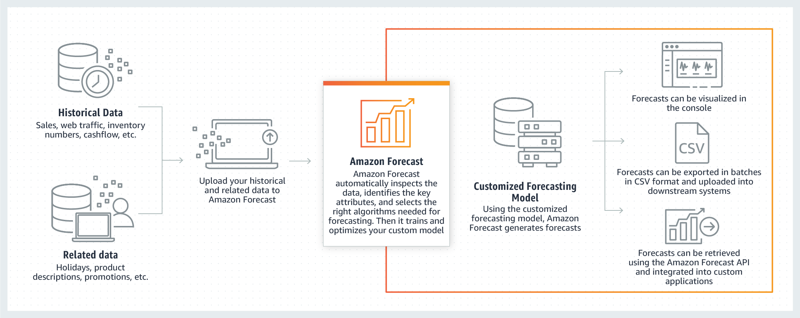
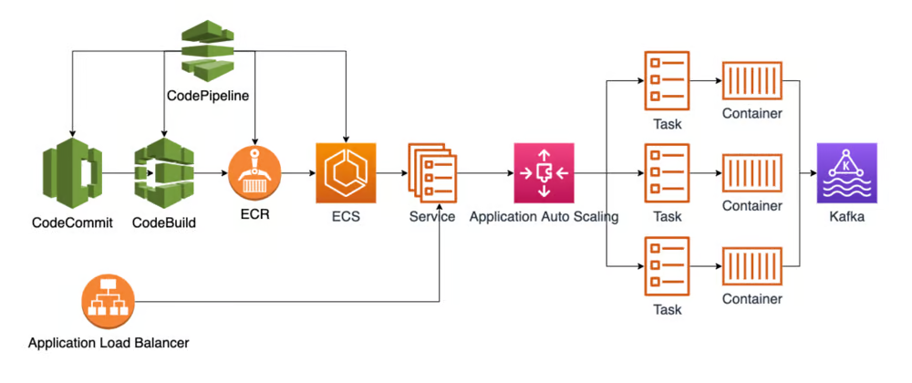

## Diapositiva 1: Sirviendo modelos en el mundo real

* Operaciones de Aprendizaje Automático I - CEIA - FIUBA

Dr. Ing. Facundo Adrián Lucianna

---

## Diapositiva 2: Repaso de la clase anterior

Operaciones de Aprendizaje Automático I - CESE - FIUBA

---

## Diapositiva 3: Despliegue de modelos

* La clase pasada vimos diferentes formas que podemos desplegar un modelo. Una que no desarrollamos es:

* **Despliegue on-line:**El cliente envía una solicitud al servidor y luego espera una respuesta. La forma más básica de esto es mediante una REST API.

---

## Diapositiva 4: Despliegue de modelos

* El sistema de aprendizaje automático y el servicio web se instalan dentro de un contenedor.

* Luego se utiliza un sistema de orquestación de contenedores para ejecutar los contenedores en un grupo de servidores físicos o virtuales.

* Similar a la máquina virtuales, se puede quitar o agregar manualmente nuevas máquinas al clúster o de forma automática.

**Desplegado en contenedores**

Contenedor 1

Contenedor 2

Contenedor 3

Contenedor 4

Contenedor 5

---

## Diapositiva 5: Desplegado on-line

* Una API es la puerta de enlace que permite a los desarrolladores comunicarse con una aplicación. Las API permiten dos cosas:

* Acceso a los datos de una aplicación.

* El uso de la funcionalidad de una aplicación.

* Al acceder y comunicarse con los datos y las funcionalidades de las aplicaciones, las API han permitido que los dispositivos, las aplicaciones y las páginas web del mundo se comuniquen entre sí para trabajar juntos para realizar tareas centradas en el negocio o en las operaciones.

**¿Qué es una interfaz de programación de aplicaciones (API)?**

---

## Diapositiva 6: Desplegado on-line

**Microservicios**

Cliente

DB

Componentes

Cliente

API

Microservicios

DB

---

## Diapositiva 7: Desplegado on-line

* El protocolo de transferencia de estado representacional (REST) se ha convertido en un estándar de oro para muchas aplicaciones, y no es muy diferente para las aplicaciones de ML actuales.

* La mayoría de las empresas prefieren desarrollar sus aplicaciones de ML basadas en el protocolo REST API. Una API REST se basa en REST, un método arquitectónico utilizado para comunicarse principalmente en el desarrollo de servicios web.

* Servir a los modelos de ML a través de una API REST tiene muchos beneficios:

* Ofrecer predicciones sobre la marcha a múltiples usuarios.

* Agregar más instancias para ampliar la aplicación detrás de un balanceador de carga.

* Combinar varios modelos utilizando diferentes Endpoints de la API.

* Separar el entorno operativo del modelo del entorno de cara al usuario.

* Habilitar la arquitectura basada en microservicios. Por lo tanto, los equipos pueden trabajar de forma independiente para desarrollar y mejorar los servicios.

**Gold estándar de****APIs****: REST API**

---

## Diapositiva 8: Desplegado on-line

* HTTP (Hypertext Transfer Protocol) es un protocolo de comunicación utilizado para la transferencia de información en la web.

* HTTP funciona según un modelo **cliente-servidor,** donde un cliente (como un navegador web) realiza solicitudes a un servidor, y el servidor responde a esas solicitudes con los datos solicitados.

* Para poder utilizar una API es necesario conocer los métodos HTTP que vimos recién y los códigos de estado que nos puede devolver.

**Gold estándar de****APIs****: REST API**

Cliente

Servidor

API

HTTP

Response

HTTP

Request

GET | POST |

PUT | DELETE

JSON | XML |

HTML

---

## Diapositiva 9: Estrategias de implementación

Operaciones de Aprendizaje Automático I - CESE - FIUBA

---

## Diapositiva 10: Estrategias de implementación

* Los servicios de Aprendizaje automático que despleguemos van a funcionar en el **mundo real** en donde personas reales interactuaran para su uso en el día a día.

* Generalmente es imposible predecir todas las acciones y reacciones de los usuarios. La arquitectura de un sistema de software destinado al mundo real debe estar preparada para tres fenómenos:

* **Errores**

* **Cambios**

* **Naturaleza humana.**

---

## Diapositiva 11: Estrategias de implementación

* Cuando hablamos de depurado de modelos, vimos que los errores son inevitables, y que, además, el error es una parte integral del modelo… **ningún modelo es perfecto**.

* Tenemos que aceptar que van a ocurrir errores, no solo eso, sino que además debemos tener en cuenta que:

* No siempre se puede explicar por qué ocurrió un error.

* No se puede predecir de manera predecible cuando volverá a suceder, inclusive una predicción con alto nivel de confianza puede estar mal.

* No siempre podemos saber cómo solucionar un error específico. Si se puede arreglar, ¿de qué tipo y cómo? ¿Se necesitan muchos datos de entrenamiento?

* Además, cuando ocurre un error, no siempre podemos esperar que la predicción incorrecta sea al menos cercana o similar a la predicción correcta.

**Estar listo para los errores**

---

## Diapositiva 12: Estrategias de implementación

* En el mundo real, es importante diseñar una estrategia que mitigue una situación en la que el sistema parezca o actúe de forma poco inteligente.

* Por ejemplo, si se diseña un chatbot, es mejor decir "No sé" que decir algo al azar.

* En sistema críticos, se recomienda entrenar un segundo modelo que prediga, para una observación, que es probable que el primer modelo cometa un error en esa entrada.

* Cuando la confianza en la predicción sea baja, puede ser conveniente considerar presentar varias opciones.

* Por eso Google presenta 10 resultados de búsqueda a la vez. Hay muchas más posibilidades de que el enlace más relevante esté entre esos 10 resultados de búsqueda que de que esté en la primera posición.

**Estar listo para los errores**

---

## Diapositiva 13: Estrategias de implementación

* Para situaciones en las que ocurrió un error y el usuario puede detectarlo, conviene agregar una posibilidad para que el usuario**informe el error.**De ahí, es recomendable generar una retroalimentación de qué acciones se tomarán para evitar que ocurra un error similar en el futuro.

* De forma similar, es apropiado medir la interacción del usuario con el sistema, registrar todas las interacciones y luego analizar las interacciones sospechosas fuera de línea.

* Para reducir aún más el impacto negativo de un error, si el sistema lo permite, es bueno permitir al usuario la opción de **deshacer una acción recomendada**por el sistema.

* Por otro lado, es importante analizar cuales salidas pueden ser demasiadas extremas, viendo con algún criterio estadístico, y dar una alerta al usuario de esto.

**Estar listo para los errores**

---

## Diapositiva 14: Estrategias de implementación

* También vimos que los modelos como todo software, se pudren, y no solo eso, sino que, además, los datos cambian sobre el tiempo (cambios de distribución).

* Lo importante es la percepción de estos cambios, algunos cambios pueden ser percibidos por el usuario como **positivos**.

* A veces, el cambio puede percibirse **negativamente**, incluso si el rendimiento del sistema mejoró Es posible que se haya agregado más datos de entrenamiento y se haya observado una mejora en la métrica de rendimiento. Sin embargo, ahora algunas clases ahora están subrepresentadas. Los usuarios interesados en las predicciones de esas clases ven una disminución en el rendimiento y se quejan o incluso abandonan su sistema.

**Estar listo para los cambios**

---

## Diapositiva 15: Estrategias de implementación

* Los usuarios se acostumbran a ciertos comportamientos inclusive si estos son productos de defectos en el sistema.

* Por lo que, si se mejora el modelo, y ahora predice de forma correcta, puede hacer que la forma que el usuario interactuaba con el mismo, ahora los frustre porque no llega a los resultados que antes.

* Si se espera que el usuario perciba negativamente algún cambio, hay que darle tiempo para adaptarse. También educar al usuario sobre los cambios y qué esperar del nuevo modelo , se puede introducir los cambios gradualmente. Las formas de desplegado (A/B testing, canary, etc) que vimos ayudan a manejar este aspecto del usuario.

**Estar listo para los cambios**

---

## Diapositiva 16: Estrategias de implementación

* La naturaleza humana es lo que hace que un sistema de software (o cualquier proyecto de ingeniería ) sea una tarea tan difícil.

* Los seres humanos son impredecibles, a menudo irracionales, inconsistentes y tienen expectativas poco claras.

* Un sistema de software debe anticipar eso, para ello debemos:

* **Evitar confusión**: El sistema debe estar diseñado de tal manera que el usuario no se sienta confundido al interactuar con él. El resultado de un modelo debe entregarse **de forma intuitiva**, sin asumir que el usuario sabe algo sobre aprendizaje automático.

* **Manejar las expectativas**: Algunos usuarios tendrán expectativas demasiado altas. La razón principal de esto es la publicidad. Para llamar la atención, un producto o sistema basado en el aprendizaje automático suele aparecer en los anuncios como inteligente… demasiado inteligente. Lástima que de esto en general se encarga los equipos de marketing 🙃

**Estar listo para lidiar con la naturaleza humana**

---

## Diapositiva 17: Estrategias de implementación

* Un sistema de software debe anticipar eso, para ello debemos:

* **Ganar la confianza**: Algunos usuarios desconfiarán de cualquier sistema si saben que contiene algo de inteligencia. La razón principal de esa desconfianza es la experiencia pasada. Un usuario experimentado con sistemas inteligentes probablemente realizará varias pruebas sencillas de las capacidades del sistema. Si el sistema falla, el usuario no confiará en él.

* **Manejar la fatiga del usuario:**La fatiga del usuario puede ser otra razón por la que haya una disminución del interés en un sistema. Es importante evitar de que el sistema no interrumpa excesivamente la experiencia del usuario con recomendaciones o solicitudes de aprobación. Evitar mostrar todo lo que tiene que mostrar de una sola vez. Siempre que sea posible, dejar que el usuario manifieste explícitamente su interés.

**Estar listo para lidiar con la naturaleza humana**

---

## Diapositiva 18: Estrategias de implementación

* Un sistema de software debe anticipar eso, para ello debemos:

* **Ganar la confianza**: Algunos usuarios desconfiarán de cualquier sistema si saben que contiene algo de inteligencia. La razón principal de esa desconfianza es la experiencia pasada. Un usuario experimentado con sistemas inteligentes probablemente realizará varias pruebas sencillas de las capacidades del sistema. Si el sistema falla, el usuario no confiará en él.

* **Manejar la fatiga del usuario:**La fatiga del usuario puede ser otra razón por la que haya una disminución del interés en un sistema. Es importante evitar de que el sistema no interrumpa excesivamente la experiencia del usuario con recomendaciones o solicitudes de aprobación. Evitar mostrar todo lo que tiene que mostrar de una sola vez. Siempre que sea posible, dejar que el usuario manifieste explícitamente su interés.

**Estar listo para lidiar con la naturaleza humana**

---

## Diapositiva 19: Estrategias de implementación

* **Evitar el factor****creepy****:**

* A veces nos puede pasar al revés, el usuario percibe la capacidad predictiva del modelo como demasiado alta. El usuario se **siente incómodo**, especialmente cuando una predicción se refiere a detalles muy privados. Es importante que el sistema no se sienta como un **Gran Hermano**y no asuma demasiadas responsabilidades.

**Estar listo para lidiar con la naturaleza humana**

Compre panchos Manolo, los mejores panchos

😱

---

## Diapositiva 20: Ejemplo de servicios de modelos

Operaciones de Aprendizaje Automático I - CESE - FIUBA

---

## Diapositiva 21: Ejemplo de servicio de modelos

* Por último, vamos a ver ejemplos de servicios de Aprendizaje Automático. La idea es estudiarlos desde sus requerimientos técnicos a como se implementó…

---

## Diapositiva 22: Problema de forecasting 1

Operaciones de Aprendizaje Automático I - CESE - FIUBA

---

## Diapositiva 23: Problema de forecasting 1

* Un equipo de Datos se le ha asignado la tarea de proporcionar pronósticos de artículos a nivel de tiendas individuales en un negocio minorista.

* Los usuarios comerciales tienen los siguientes requisitos:

* Los pronósticos deben presentarse y ser accesibles a través de un panel de control basado en la web.

* El usuario debería poder solicitar predicciones actualizadas si fuera necesario.

* Las predicciones deben realizarse a nivel de tiendas individuales.

* Los usuarios estarán interesados en sus propias regiones/tiendas y no se preocuparán por las tendencias globales.

* El número de solicitudes de pronósticos actualizados en cualquier sesión será pequeño.

---

## Diapositiva 24: Problema de forecasting 1

* Dado estos requerimientos, se crean historias de usuarios, que se puede introducir en un servicio de gestión de proyectos. Menciónenos algunas:

* Historia de usuario 1: Como planificador de logística, quiero iniciar sesión en un panel por la mañana y poder ver las previsiones de demanda de artículos a nivel de tienda para los próximos días.

* Historia de usuario 2: Como planificador de logística, quiero poder solicitar una actualización de mi pronóstico si veo que está desactualizado. Quiero que el nuevo pronóstico aparezca en un tiempo razonable.

* Historia de usuario 3: Como planificador de logística, quiero poder filtrar pronósticos basados en tiendas específicas.

---

## Diapositiva 25: Problema de forecasting 1

* De estas historias, podemos empezar a obtener información técnica:

---

## Diapositiva 26: Problema de forecasting 1

* Entender los requerimientos nos dan el **que**, pero no el **cómo**. Para desarrollar el **cómo**, vamos a usar las herramientas que vimos en esta materia y en la carrera.

* Primero, debemos confirmar en qué tipo de despliegue deberíamos trabajar. Dado que necesitamos solicitudes dinámicas, tiene sentido que sigamos el **despliegue on-line usando microservicios**.

* Además, dado que tenemos modelos individuales por tienda, debemos planificar tener un **almacenaje de modelos**.

* El servicio debe tener como objetivo obtener el modelo correcto del almacén y realizar la inferencia solicitada. El servicio debe tener **interfaz de comunicación**con el dashboard y el almacenaje de modelos.

* Además, dado que un usuario puede querer trabajar con algunas combinaciones de tiendas en cualquier sesión y tal vez alternar entre los pronósticos de estas, debemos **proporcionar un mecanismo para hacerlo que sea eficaz**.

---

## Diapositiva 27: Problema de forecasting 1

* Del escenario también se observa claramente que podemos fácilmente tener un **volumen muy alto de solicitudes de predicciones**, pero una **menor solicitud de re-entrenamiento**de modelos.

* De los requisitos también podemos deducir que el sistema de entrenamiento no tiene que activarse necesariamente mediante el control de cambio de distribución, sino mediante **solicitudes dinámicas del usuario**. Hay que determinar un sistema que evite el re-entrenamiento innecesario. Por ejemplo, si cuatro usuarios inician sesión y buscan la misma combinación de región/tienda/artículo y todos solicitan un reentrenamiento, no es necesario entrenar 4 veces lo mismo.

---

## Diapositiva 28: Problema de forecasting 1

* De establecer los cómo, podemos llegar a este diagrama de bloques:

Dashboard

Manejo de entrenamiento

Manejo de forecasting

Pipeline de entrenamiento

Servicio de forecasting

Request actualizar

el modelo

Request predicción

Ejecutar re-entrenamiento

Si es necesario

Obtener predicción

---

## Diapositiva 29: Problema de forecasting 1

* Veamos algunas tecnologías del modelo:

---

## Diapositiva 30: Problema de forecasting 1

* Veamos algunas tecnologías del modelo:

---

## Diapositiva 31: Problema de forecasting 1

Dashboard

REST API

HTTP

REST API

HTTP

Servicio de manejo

Endpoint de entrenamiento

Endpoint de forecasting

---

## Diapositiva 32: Problema de forecasting 1

* **Evitemos re-inventar la rueda**. Nuestro servicio va a funcionar en la nube de AWS, y dado esto, podemos usar un servicio denominado **AWS****Forecast**:

---

## Diapositiva 33: Problema de forecasting 1

* **Evitemos re-inventar la rueda**. Nuestro servicio va a funcionar en la nube de AWS, y dado esto, podemos usar un servicio denominado **AWS****Forecast**:

* Es un servicio administrado que permite crear, entrenar y predecir a partir de diferentes modelos de pronóstico de series temporales a través de llamadas API.

* Abstrae gran parte del trabajo pesado que de otro modo tendríamos que hacer y nos permite crear rápidamente un servicio de pronóstico con el que servicio de manejo pueda interactuar.

* AWS nos ofrece una interacción directa con este servicio y Python usando boto3.

---

## Diapositiva 34: Problema de forecasting 1

AWS Forecast

Dashboard

REST API

HTTP

REST API

HTTP

Servicio de manejo

Endpoint de entrenamiento

Endpoint de forecasting

Pipeline de entrenamiento

Servicio de forecasting

Almacén de

modelos

Series de

tiempo

---

## Diapositiva 35: Problema de forecasting 1

* **Endpoint****de entrenamiento:**La lógica de la aplicación detrás del endpoint de entrenamiento debe contener una verificación de que el modelo para el que se solicita un re-entrenamiento no se haya actualizado recientemente antes de proceder a solicitar un nuevo trabajo de entrenamiento y una actualización del modelo.

* **Endpoint****de****forecasting****:**La lógica de aplicación detrás del endpoint de pronóstico debe garantizar que el modelo requerido para el pronóstico esté disponible. Si no es así, deberá recuperarlo en la tienda de modelos. Después de hacer esto, debería usar el modelo para producir un pronóstico que pueda representarse y almacenarse en el panel del usuario.

---

## Diapositiva 36: Problema de forecasting 2

Operaciones de Aprendizaje Automático I - CESE - FIUBA

---

## Diapositiva 37: Problema de forecasting 2

* Este problema es muy similar al anterior, pero ahora la tarea en proporcionar pronósticos de artículos a nivel de tiendas las cuales son de clientes, y estos venden en una plataforma conocida de retail.

* Los usuarios tienen los siguientes requisitos:

* Los pronósticos deben presentarse y ser accesibles a través de un servicio ofrecido por la empresa encargada de gestionar los datos de los clientes.

* Las predicciones deben realizarse a nivel de tiendas individuales y productos individuales.

* Los usuarios estarán interesados en sus propias tiendas y no se preocuparán por las tendencias globales.

* Los clientes están interesados en las ventas mensuales.

---

## Diapositiva 38: Problema de forecasting 2

* Dado estos requerimientos, se crean historias de usuarios, que se puede introducir en un servicio de gestión de proyectos. Menciónenos algunas:

* Historia de usuario 1: Como cliente, quiero ingresar a mi área de usuario del sistema y observar cuales son el pronóstico de ventas de mis productos para el siguiente año.

* Historia de usuario 2: Como cliente, quiero poder filtrar pronósticos basados en productos específicos.

---

## Diapositiva 39: Problema de forecasting 2

* De estas historias, podemos empezar a obtener información técnica:

---

## Diapositiva 40: Problema de forecasting 2

* Para este caso, las solicitudes no son dinámicas, y tienen un plazo largo de predicción. Para este caso tiene sentido que sigamos el **despliegue en lote con subida de los datos en una base de datos y servicio de consulta a la misma**.

* Dado que tenemos modelos individuales por tienda y producto, debemos planificar tener un **almacenaje de modelos**.

* El servicio debe tener como objetivo obtener el modelo correcto del almacén y realizar la inferencia solicitada. El servicio debe tener **interfaz de comunicación**con el sistema de la empresa (que posee el dashboard) y el almacenaje de modelos.

* Del escenario también se observa claramente que se debe **re-entrenar de forma mensual**a todos los modelos.

---

## Diapositiva 41: Problema de forecasting 2

* De establecer los cómo, podemos llegar a este diagrama de bloques:

Integracióncon Retail

Limpieza y estructuración de datos

Modelado y predicción

Servicio de consulta

Plataforma web

Almacenaje de datos

---

## Diapositiva 42: Problema de forecasting 2

---

## Diapositiva 43: Problema de forecasting 2

---

## Diapositiva 44: Problema de forecasting 2

* Para este caso el sistema original en el que se va a montar el servicio de forecasting funciona en Azure, por lo que se va a usar la tecnología ofrecidas por ellos.

* Azure no ofrece un servicio de forecasting, por lo que esta implementación debe trabajarse en más partes.

* Pero si se aprovecha el servicio de Azure Repos, el cual permite el registro de los repositorios de código y el fácil desplegado de las diferentes partes mediante CI/CD.

---

## Diapositiva 45: Problema de forecasting 2

* Para la captura de datos, se obtiene **diariamente** mediante consultas a la API del retail:

Daily tracker

**JSON**

API

Retail

---

## Diapositiva 46: Problema de forecasting 2

* A los datos crudos obtenidos de la API retail, mensualmente pasan por un proceso ETL, el cual se preparan para entrenar los modelos. Estos se procesan usando Azure Data Factory y HDInsight. Los datos se pasan a un formato parquet para facilitar el uso posterior, con particionado de datos.

Monthly ETL

**Parquet**

**JSON**

---

## Diapositiva 47: Problema de forecasting 2

* Con los datos mensuales, el equipo de Machine Learning desarrollaron un servicio de predicción en bache, el cual usando como sincronizador a Apache Airflow y como oquestador a Azure VM, se levantan máquinas virtuales que toman parte de los datos y realizan el **entrenamiento y predicción**usando **pmarima** para un conjunto de productos de 1 a 12 meses. Esto ocurre una vez al mes, luego que termina el proceso de ETL.

**Parquet**

Monthly Forecasting model

**CSV**

---

## Diapositiva 48: Problema de forecasting 2

* Las predicciones se guardan en CSV. Por otro lado, previo al re-entrenamiento de los modelos, se compara el resultado obtenido de las predicciones obtenidas el mes pasado, con las ventas del último mes. Se guardan estos resultados para uso interno del equipo.

**Parquet**

Monthly Forecasting model

**CSV**

---

## Diapositiva 49: Problema de forecasting 2

* Los datos CSV finalmente son ingestados a una base de datos NoSQL que permite una rápida obtención de los resultados. Para cada cliente, y sus productos, se almacena un vector con las ultimas 12 predicciones.

**CSV**

Ingesta en DB

---

## Diapositiva 50: Problema de forecasting 2

* Finalmente, los datos son consultados por el cliente a través de un servicio que conecta con la base de datos y mediante una API envía los datos al frontend, que se encarga de la visualización.

Azure

App Services

Servicio Backend

App frontend

API

---

## Diapositiva 51: Problema de seguimiento de usuarios

Operaciones de Aprendizaje Automático I - CESE - FIUBA

---

## Diapositiva 52: Problema de seguimiento de usuarios

* Este problema nace como respuesta a la noticia de Enero 2020 de Google Chrome iba a abandonar el uso de la thirdparty cookies.

* OBS: Esto se pospuso, pero a partir de enero de 2024, se empezó a aplicar al 1% de los usuarios.

Identificador

Sitio 1

Sitio 2

Sitio 3

---

## Diapositiva 53: Problema de seguimiento de usuarios

* Con este identificador, los sitios web puede ofrecer a las empresas que desean publicitar en ellas, que sirvan publicidad en función del perfil del usuario (audiencia).

* Este proceso de venta ocurre en un **Ad Exchange**, el cual se ofrece un remate al mejor postor. Esto ocurre en el mismo momento que ingresa el usuario al sitio web.

Ad Exchange

Ad 1

Ad 2

Ad 3

Hombre, 25-35 años

Otaku

---

## Diapositiva 54: Problema de seguimiento de usuarios

* Casi todos los navegadores ya no usan estas cookies, salvo Google Chrome, pero el detalle es que Google Chrome representa el 80% de los usuarios.

* Si se dejan de usar las cookies, se pierde la posibilidad de rastrear al usuario que visita diferentes sitios web. Eso nos lleva a que no se pueda construir las audiencias.

* Es necesario identificar a los usuarios, pero que no sea invasivo y que este dentro de las normas de los países.

---

## Diapositiva 55: Problema de seguimiento de usuarios

* Dado estos requerimientos, se crean historias de usuarios, que se puede introducir en un servicio de gestión de proyectos. Menciónenos algunas:

* Historia de usuario 1: Como generador de audiencias, quiero conocer cuáles son los usuarios que visitan los sitios web de mis proveedores así puedo construir un perfil de ellos.

* Historia de usuario 2: Como empresa de publicidad quiero que mi publicidad llegue a la mayor cantidad de usuarios que se ajustan a mi público objetivo.

* Historia de usuario 3: Como usuario que ingreso a un sitio web, quiero que el sitio se cargue lo más rápido posible.

---

## Diapositiva 56: Problema de seguimiento de usuarios

* De estas historias, podemos empezar a obtener información técnica:

---

## Diapositiva 57: Problema de seguimiento de usuarios

* Para este problema se necesita de un **modelo complejo dividido en muchas etapas**, dado que se quiere identificar a un usuario de entre millones, que visitan millones de sitios web. Se puede pensar en **modelos de grafos**que una a las visitas de diferentes sitios web.

* Cada sitio web puede almacenar un identificador propio para identificar a un usuario en su sitio web y puede hacer uso de estos datos sin problemas legales. Algunos datos, sobre todo de usuarios que se registran tiene un **identificador determinista**(DNI, email, etc) y estos se permiten compartir (hasheados) dado que el usuario acepta ToC.

* Dado que se necesita obtener el identificador de usuario lo más rápido posible, y los datos de los usuarios no se modifican tanto, pero son miles de millones, el **modelo de despliegue en lote**parece es el que mejor que se ajusta.

* Los datos se pueden re-entrenar **de forma semanal** dado que el comportamiento de los usuarios no es muy dinámico.

---

## Diapositiva 58: Problema de seguimiento de usuarios

* De establecer los cómo, podemos llegar a este diagrama de bloques:

Proveedores (sitios webs)

Modelado y predicción

Servicio de consulta

Sitio web

Almacenaje de datos

Generador de grafo

Base de datos

Ad Exchange

Identificador

Limpieza de datos

---

## Diapositiva 59: Problema de seguimiento de usuarios

* El modelo es un clasificador para identificar si dos visitas es de un mismo usuario

---

## Diapositiva 60: Problema de seguimiento de usuarios

* El modelo es un clasificador para identificar si dos visitas es de un mismo usuario

---

## Diapositiva 61: Problema de seguimiento de usuarios

* El modelo es un clasificador para identificar si dos visitas es de un mismo usuario

---

## Diapositiva 62: Problema de seguimiento de usuarios

* Para este caso el sistema original en el que se va a montar el servicio funciona en AWS, pero dado el gran volumen de datos con que se trabaja, toda la infraestructura se usa principalmente es Apache Spark montado sobre AWS EMR.

* Además, la infraestructura se crea y destruye usando Infraestructure as Code mediante Terraform. Este permite el fácil desplegado de las diferentes partes mediante CI/CD junto a GitHub Actions.

---

## Diapositiva 63: Problema de seguimiento de usuarios

* Para la captura de datos, se colocan en el proveedor un **pixel** encargado de tomar los datos de las visitas, los cuales son almacenados en JSON en S3. Cada visita se almacena los datos del user-agent, IP publica, el sitio web visitado, datos de ubicación (pais, ciudad), el timestamp y query de la visita. Además, si tiene, el identificador de usuario registrado.

**JSON**

Pixel en proveedor

---

## Diapositiva 64: Problema de seguimiento de usuarios

* Un proceso ETL de apache SPARK que corre diariamente, levanta los datos de visitas y los procesa extrayendo los datos necesarios. Estos datos, se unifican para cada sitio web se unifican con el identificador de usuario de ese sitio web (firstparty cookie).

**Parquet**

**JSON**

Daily ETL

---

## Diapositiva 65: Problema de seguimiento de usuarios

* En este proceso se va acumulando información del usuario, tales como el historial de últimos 30 días de página web de un proveedor que visitó y queries que uso. Dispositivos diferentes, versiones de browser, rango de IPs, etc.

**Parquet**

**JSON**

Daily ETL

---

## Diapositiva 66: Problema de seguimiento de usuarios

* Diariamente usando AWS SageMaker se levanta varias instancias con el modelo XGBoost, el cual predice de a pares, si los identificadores de usuarios registrados de diferentes proveedores son del mismo usuario o no.

**CSV**

**Parquet**

Daily prediction

---

## Diapositiva 67: Problema de seguimiento de usuarios

* Con los resultados del modelo que unen a los identificadores de diferentes proveedores, y los identificadores deterministas, se construye grafos arman a todos los identificadores que se observan en diferentes proveedores a un mismo usuario. El cual, para cada grafo se asigna un identificador único que nuclea a todos.

**Parquet**

**CSV**

Daily

**Parquet**

---

## Diapositiva 68: Problema de seguimiento de usuarios

* Una vez que se tiene los datos del grafo. Se ingestan los datos en un cluster de Redis. Se usa como llave el firstparty cookie, y como valor el identificador único.

**Parquet**

Daily ingest

---

## Diapositiva 69: Problema de seguimiento de usuarios

* Cuando un usuario visita un sitio web con el pixel, se obtiene su firstparty cookie y se obtiene el valor del identificador. Esto ocurre con muy baja latencia (< 200ms), y ese identificador es el que luego se obtiene la audiencia para ir al Ad Exchange.

Pixel en proveedor

---

## Diapositiva 70: Problema de seguimiento de usuarios

* Para el entrenamiento, cada semana se levantan los datos de los últimos 6 meses de visitas de aquellos usuarios que están registrados o se sabe deterministamente de que usuario son las visitas. Se entrena el modelo, y se compara el resultado con el modelo anterior con respecto a un lote de testeo. Si es mejor, se guarda el artefacto del modelo para su uso en predicciones.

**Artefacto del modelo**

**Parquet**

Weekly prediction

---

## Diapositiva 71: Problema de seguimiento de usuarios

* Durante el entrenamiento se guardan las métricas del modelo, y durante la predicción se guardan métricas asociadas a la cantidad de grafos y tamaños de los mismo para evaluación del estado de salud del sistema.